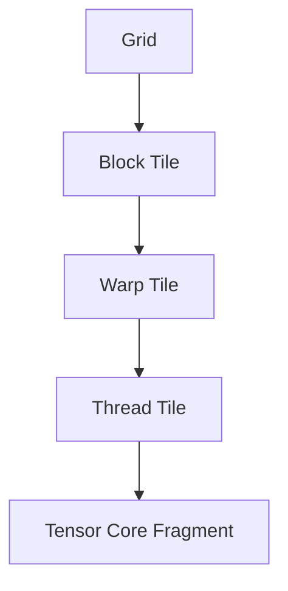

# Rebuilding cuBLAS: From a Naive CUDA Kernel to a Tensor Core Pipeline

A correct GEMM kernel is easy to write. A fast one is not. This repository closes the gap between `~465 GFLOP/s` and the `65 TFLOP/s` FP16 Tensor Core peak through a repeated diagnostic loop:

**profile → identify bottleneck → intervene → re-measure**

Each kernel version isolates one structural change, explains the bottleneck it targets, and documents what becomes the next limiting factor.


---

## Table of Contents

1. [Problem Statement](#1-problem-statement)
2. [Research Objective](#2-research-objective)
3. [Why GEMM Matters](#3-why-gemm-matters)
4. [Hardware Context](#4-hardware-context)
5. [Conceptual Dataflow](#5-conceptual-dataflow)
6. [Execution Hierarchy](#6-execution-hierarchy)
7. [Optimization Roadmap](#7-optimization-roadmap)
8. [Stage-by-Stage Breakdown](#8-stage-by-stage-breakdown)
9. [Performance Results](#9-performance-results)
10. [Development Backlog](#10-development-backlog)
    - [10.1 Compilation and the NVCC Story](#101-compilation-and-the-nvcc-story)
    - [10.2 The Memory Wall Problem](#102-the-memory-wall-problem)
    - [10.3 What's Next](#103-whats-next)
11. [Experimental Methodology](#11-experimental-methodology)
12. [Conclusion](#12-conclusion)
13. [Inspiration and Acknowledgement](#13-inspiration-and-acknowledgement)

---

## 1. Problem Statement

The core computation studied here is GEMM:

```
C = alpha * A * B + beta * C
```

Following standard conventions:

- `A ∈ ℝ^(M × K)`
- `B ∈ ℝ^(K × N)`
- `C ∈ ℝ^(M × N)`

A naive GPU implementation of GEMM fails to exploit the memory and execution hierarchies of NVIDIA GPUs. Despite enormous theoretical parallelism, a simple kernel typically suffers from:

- excessive global-memory traffic
- poor data reuse and low arithmetic intensity
- high load/store instruction overhead
- register pressure
- insufficient overlap between memory and compute
- underutilization of Tensor Cores

This repository investigates how those inefficiencies can be removed systematically through kernel restructuring.

---

## 2. Research Objective

> **How does a CUDA GEMM kernel need to be transformed, stage by stage, to progress from a correctness-oriented baseline to a structured, high-performance GPU matrix multiplication?**

The project aims to:

1. Identify the dominant bottleneck at each optimization stage.
2. Introduce one isolated structural optimization to address that bottleneck.
3. Explain the resulting dataflow and execution model.
4. Analyze the trade-offs each architectural change introduces.
5. Build a logical progression from scalar CUDA core execution to asynchronous Tensor Core pipelines.

---

## 3. Why GEMM Matters

GEMM is foundational in scientific computing, numerical linear algebra, and deep learning. Many higher-level operations reduce to matrix multiplication, making it a core primitive that often determines end-to-end performance.

For GPU performance engineering, GEMM is an ideal case study because it exposes the full interaction between:

- thread hierarchy and warp scheduling
- global and shared memory bandwidth
- register reuse and instruction issue throughput
- specialized hardware such as Tensor Cores

---

## 4. Hardware Context

The diagrams below serve as architectural reference throughout the optimization story.


Key notes:

- Kernels are written from the perspective of a single thread's local work.
- All threads in the grid execute the same kernel function.
- Performance comes from coordinating those threads to match the GPU's memory and execution hierarchy.

---

## 5. Conceptual Dataflow

Optimized GEMM progressively transforms the computation from direct global-memory access into a staged, hierarchical pipeline:


The optimization sequence improves each transition:

- global memory → shared memory
- shared memory → registers
- registers → accumulators
- accumulators → final output

---

## 6. Execution Hierarchy

An optimized GEMM must align with the GPU's execution hierarchy at every level:



Early kernels operate at the block and thread level. Later kernels introduce warp-aware tiling and Tensor Core mapping so that work granularity matches the actual hardware scheduling model.

---

## 7. Optimization Roadmap

| Version | File                                       | Core Optimization              | Main Bottleneck Targeted                         |
| :------ | :----------------------------------------- | :----------------------------- | :----------------------------------------------- |
| **01**  | `01. Build Naive SGEMM.cu`                 | Baseline CUDA SGEMM            | Establish correctness and baseline mapping       |
| **02**  | `02. Shared Memory Tiling.cu`              | Shared-memory tiling           | Repeated global-memory accesses                  |
| **03**  | `03. Register Tiling - 1 side.cu`          | 1D register tiling             | Low arithmetic intensity                         |
| **04**  | `04. Register Tiling - 2 side.cu`          | 2D register tiling             | Excessive shared-memory traffic per output       |
| **05**  | `05. Vectorized Register Tiling.cu`        | Vectorized loads/stores        | Load/store instruction pressure                  |
| **06**  | `06. Warp Tiling.cu`                       | Warp tiling                    | Scheduler alignment, locality, register pressure |
| **07**  | `07. Tensor Cores (Async TMA + WGMMA).cu`  | WMMA Tensor Core baseline      | Transition from scalar FMA to Tensor Cores       |
| **08**  | `08. Tensor Cores - Shared Memory WMMA.cu` | Shared-memory staged WMMA      | Tensor Core operand reuse and feed efficiency    |
| **09**  | `09. Async Producer–Consumer Pipeline.cu`  | Software pipelining & epilogue | Pipeline bubbles and load/compute serialization  |

---

## 8. Stage-by-Stage Breakdown

### Version 01: Naive SGEMM

The baseline maps one output element per thread. Each thread traverses the full reduction dimension independently.

- **Bottleneck:** Every thread redundantly loads from global memory. Arithmetic intensity is near zero.

### Version 02: Shared-Memory Tiling

Threads in a block cooperatively load `A` and `B` tiles into shared memory before computing.

- **Improvement:** A single tile loaded from global memory is reused across the whole block, drastically reducing global bandwidth.
- **New bottleneck:** Each output still demands many shared-memory reads.

### Versions 03 and 04: Register Tiling

Each thread is assigned multiple output elements (1D tiling, then 2D tiling).

- **Improvement:** Operands held in registers are reused across multiple FMA instructions. Arithmetic intensity rises and shared-memory reads per output fall.
- **Trade-off:** Higher register usage per thread can limit occupancy if tile sizes are not tuned carefully.

### Version 05: Vectorized Register Tiling

Replaces scalar loads with vector instructions (`float4`, 128-bit).

- **Improvement:** Each issued instruction fetches more data. Load/store instruction count drops, improving front-end efficiency independently of coalescing.

### Version 06: Warp Tiling

Assigns each warp ownership of a contiguous output sub-tile.

- **Improvement:** Work is now aligned with the GPU's true execution unit. Scheduler efficiency, spatial locality, and register reuse all improve. This is the conceptual bridge toward Tensor Cores.

### Version 07: Tensor Core WMMA Baseline

Replaces scalar FMA on CUDA cores with warp-wide matrix multiply-accumulate on Tensor Cores.

- **Improvement:** Specialized matrix hardware is engaged. The optimization problem now shifts from organizing scalar arithmetic to feeding the Tensor Cores efficiently.

### Version 08: Shared-Memory Staged WMMA

Stages Tensor Core operands through shared memory instead of loading fragments directly from global memory.

- **Improvement:** Operand reuse across warps is restored. Locality improves substantially and the dataflow approaches production-grade Tensor Core kernels.

### Version 09: Producer-Consumer Pipeline and Epilogue Staging

Adds software pipelining and a shared-memory epilogue stage.

- **Improvement:** Memory fetches (producer) and computation (consumer) are overlapped, reducing Tensor Core stalls. Epilogue staging enables coalesced writes to global memory.

---

## 9. Performance Results

Benchmark: matrix dimensions `2048 × 2048 × 2048`.

| Kernel                             | Time (ms) | Performance (GFLOP/s) | Max Absolute Error | Status  |
| :--------------------------------- | :-------- | :-------------------- | :----------------- | :------ |
| **01. Naive SGEMM**                | 36.896    | 465.63                | 1.83e-04           | ✅ Pass |
| **02. Shared Memory Tiling**       | 20.195    | 850.68                | 1.83e-04           | ✅ Pass |
| **03. Register Tiling (1D)**       | 16.164    | 1062.82               | 1.83e-04           | ✅ Pass |
| **04. Register Tiling (2D)**       | 12.473    | 1377.36               | 1.83e-04           | ✅ Pass |
| **05. Vectorized Register Tiling** | 5.199     | 3304.42               | 1.83e-04           | ✅ Pass |
| **06. Warp Tiling**                | 13.326    | 1289.19               | 1.83e-04           | ✅ Pass |
| **07. Tensor Cores (WMMA)**        | 7.780     | 2208.25               | 0.00e+00           | ✅ Pass |
| **08. Tensor Cores SMEM WMMA**     | 7.052     | 2436.32               | 0.00e+00           | ✅ Pass |
| **09. Async Pipeline WMMA**        | 6.340     | 2709.72               | 0.00e+00           | ✅ Pass |

---

## 10. Development Backlog

### 10.1 Compilation and the NVCC Story

`nvcc` is not just a compiler. It is a multi-stage compilation driver, and a missing architecture flag can produce silently wrong results that pass compilation and report plausible-looking (but completely fabricated) performance numbers.

- **Stage 1 — Split.** `nvcc` separates host code (handed to `clang`/`gcc`) from device code (handled by NVIDIA's device compiler). This is why `__CUDA_ARCH__` guards exist: they are only defined during the device compilation pass.

- **Stage 2 — PTX generation.** Device code is lowered to PTX, NVIDIA's virtual assembly. This is where WMMA intrinsics map to PTX instructions:

```
nvcuda::wmma::mma_sync(...)    →  wmma.mma.sync.aligned.m16n16k16.row.col.f32.f16.f16.f32
nvcuda::wmma::load_matrix_sync →  wmma.load.a.sync.aligned.m16n16k16.global.row
```

- **Stage 3 — SASS via `ptxas`.** PTX is compiled to real machine instructions. This is where `-arch=sm_75` becomes critical. Without it, `ptxas` defaults to `sm_52` (Maxwell), which has no WMMA opcodes. The `#if __CUDA_ARCH__ >= 700` block compiles away entirely, producing a kernel that completes in `0.006 ms` and reports `2.7 PFLOP/s` — a perfectly empty benchmark. This was the root cause of ghost performance numbers seen in versions 07–09 before the flag was identified.

- **Stage 4 — Fatbinary packaging.** The final binary packages both PTX and the compiled cubin. The CUDA driver selects the right path at runtime based on actual hardware.

> **Compiler flags are not optimization hints. They are architecture contracts.**

### 10.2 The Memory Wall Problem

After validating all nine kernels against cuBLAS, a deeper question surfaced:

> Why did Tensor Core kernels (07–09) top out at `~2.7 TFLOP/s` — below the pure FP32 vectorized kernel (05) at `3.3 TFLOP/s` — on hardware with a `65 TFLOP/s` FP16 Tensor Core peak?

The answer: Tensor Cores finish a `16×16×16` matrix multiply in 1–2 clock cycles, then the warp idles waiting for the next tile to arrive over the `320 GB/s` global memory bus. Version 05 issued `8×` fewer memory instructions using `float4` vectorized loads and saturated the bus more efficiently.

This is the classic **memory wall**.

**Kernel 10 (attempted):** replacing scalar `__half` loads with `int4` (128-bit) vectorized loads and `float4` epilogue writes produced a result slightly _slower_ than version 09 (`2466` vs `2709 GFLOP/s`). The reason: tiles (`BLOCK_TILE_M=32, BLOCK_TILE_N=64`) were too small. With 256 threads but only 64 `int4` loads for the A tile, 75% of threads sat idle during each load phase. Instruction count dropped 8×, but so did warp-level memory parallelism.

> **Vectorization and larger tiles must go together.**

### 10.3 What's Next

| Kernel | Target Hardware   | Technique                                                                                                       |
| :----- | :---------------- | :-------------------------------------------------------------------------------------------------------------- |
| **11** | Turing (T4, SM75) | `128×128` tiles with `int4` vectorized loads — closing the memory wall                                          |
| **12** | Ampere+ (SM80)    | `cp.async` pipeline — hardware-async Global→Shared, warp never stalls on a load                                 |
| **13** | Hopper (SM90)     | `TMA + WGMMA` — dedicated DMA engine and 4-warp cooperative MMA, foundation of modern FlashAttention and cuBLAS |

---

## 11. Experimental Methodology

All kernels are evaluated under the same protocol:

1. **Fixed dimensions** — standardized matrix sizes (e.g., `M=N=K=4096`) ensure caching effects are consistent across runs.
2. **Warmup runs** — cold-start anomalies are masked before timing begins.
3. **Reference validation** — maximum absolute error is checked against cuBLAS to guarantee correctness.
4. **Profiling** — throughput is reported in `GFLOP/s` and paired with Nsight Compute stall metrics (Memory Dependency, Execution Dependency) to explain each bottleneck.

---

## 12. Conclusion

High-performance GEMM is not the result of one algorithmic trick. It emerges from a sequence of hardware-aligned structural changes, each one removing the constraint that was limiting the previous version. By tracing the full path from naive global-memory access to asynchronous Tensor Core pipelines, this repository makes the trade-offs of modern GPU programming concrete and observable.

---

## 13. Inspiration and Acknowledgement

This work is shaped by performance-engineering writeups that treat GEMM optimization as a sequence of isolated structural changes rather than a single opaque final kernel. In particular, Hamza Elshafie's H100 GEMM optimization study helped frame the methodology: analyze one optimization at a time, identify the bottleneck it targets, and explain the hardware consequences of each change.
