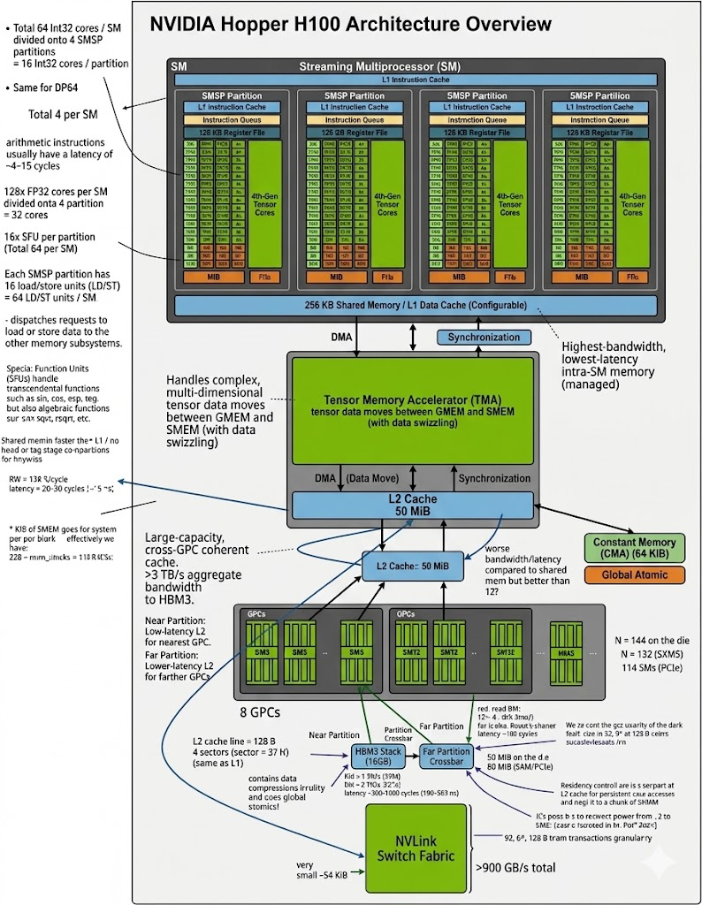
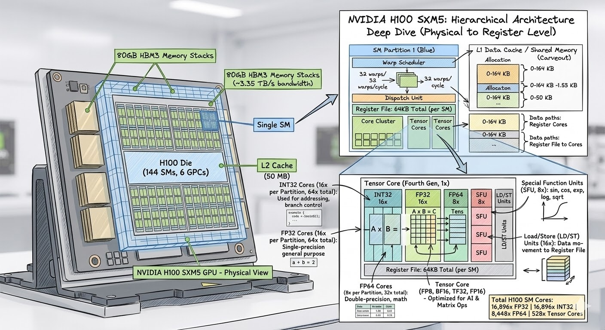
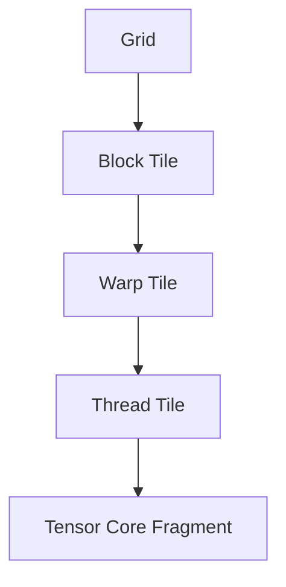
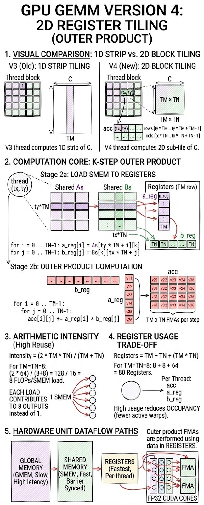
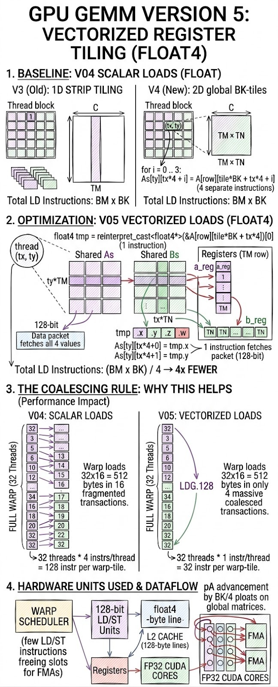
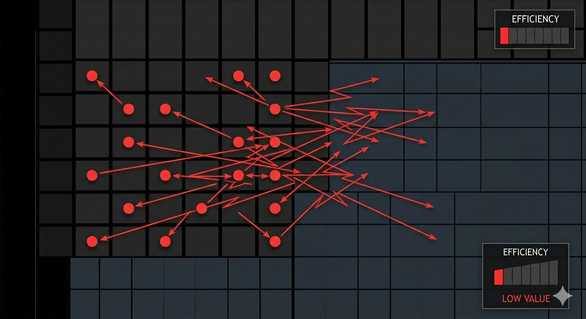
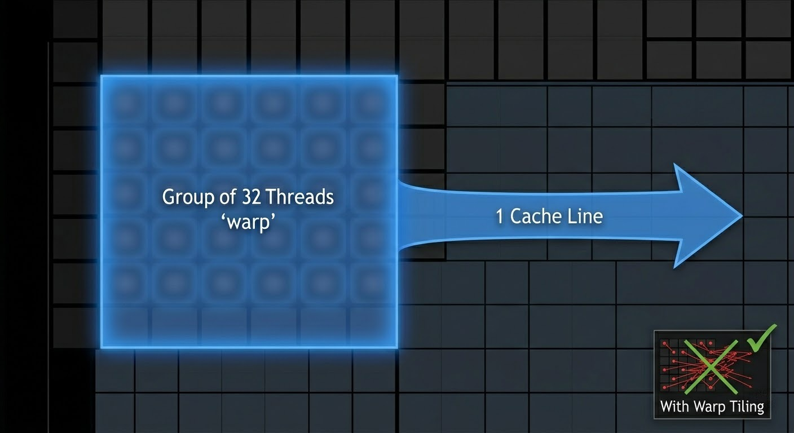
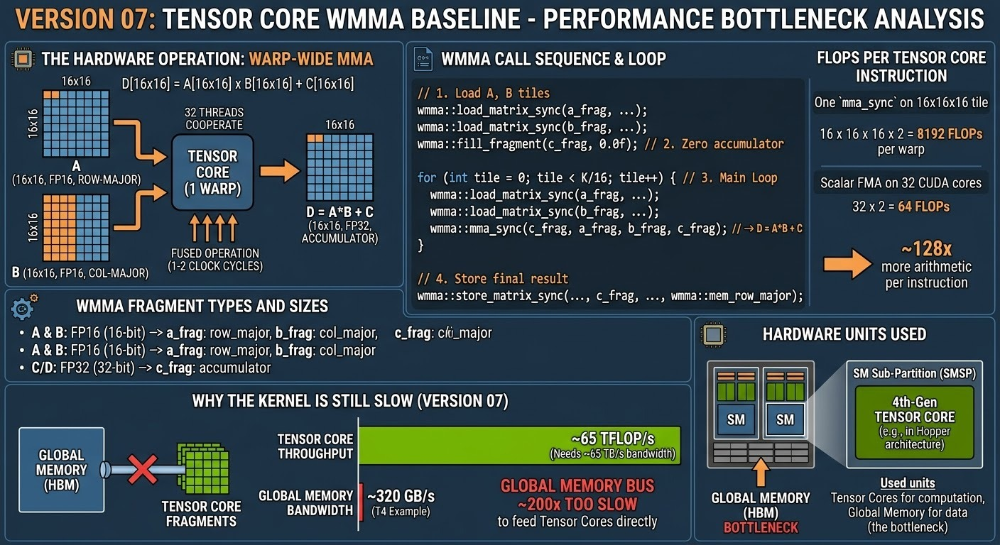

# Rebuilding cuBLAS: From a Naive CUDA Kernel to a Tensor Core Pipeline

A correct GEMM kernel is easy to write. A fast one is not. This repository traces the systematic optimization of GEMM on an NVIDIA T4 GPU — closing the gap from a naive `~465 GFLOP/s` up to the hardware's FP32 ceiling of `~3,985 GFLOP/s` (90% of real performance cuBLAS), and eventually moving to Tensor Cores to chase the `65 TFLOP/s` FP16/FP32 peak — through a repeated diagnostic loop:

**profile → identify bottleneck → intervene → re-measure**

Each kernel version isolates one structural change, explains the bottleneck it targets, and documents what becomes the next limiting factor.



---

## Table of Contents

1. [Problem Statement](#1-problem-statement)
   - [1.1 Why Parallel Computing Became Necessary](#11-why-parallel-computing-became-necessary)
   - [1.2 The Gap Parallelism Creates](#12-the-gap-parallelism-creates)
   - [1.3 Why GEMM Is the Right Kernel to Study](#13-why-gemm-is-the-right-kernel-to-study)
2. [Research Objective](#2-research-objective)
   - [The Two-Phase Goal](#the-two-phase-goal)
3. [Hardware Context](#3-hardware-context)
   - [Execution Hierarchy](#execution-hierarchy)
4. [Optimization Roadmap](#4-optimization-roadmap)
5. [Stage-by-Stage Breakdown](#5-stage-by-stage-breakdown)
   - [Version 01: Naive SGEMM](#version-01-naive-sgemm)
   - [Version 02: Shared-Memory Tiling](#version-02-shared-memory-tiling)
   - [Version 03: Thread-level Strip Tiling (1D tilling)](#version-03-thread-level-strip-tiling-1d-tilling)
   - [Version 04: Register Tiling (2D)](#version-04-register-tiling-2d)
   - [Version 05: Vectorized Register Tiling](#version-05-vectorized-register-tiling)
     - [Why this helps — the coalescing rule](#why-this-helps--the-coalescing-rule)
   - [Version 06: Warp Tiling](#version-06-warp-tiling)
     - [Why warp alignment matters](#why-warp-alignment-matters)
     - [Why v06 is slower than v05 despite better warp alignment](#why-v06-is-slower-than-v05-despite-better-warp-alignment)
     - [The problem comes](#the-problem-comes)
   - [Version 07: Tensor Core WMMA Baseline](#version-07-tensor-core-wmma-baseline)
     - [Why the kernel is still slow (version 07)](#why-the-kernel-is-still-slow-version-07)
     - [The problem comes](#the-problem-comes-1)
   - [Version 08: Shared-Memory Staged WMMA](#version-08-shared-memory-staged-wmma)
   - [Version 09: Producer-Consumer Pipeline and Epilogue Staging](#version-09-producer-consumer-pipeline-and-epilogue-staging)
   - [Version 10: Vectorized Tensor Core Pipeline](#version-10-vectorized-tensor-core-pipeline)
     - [Why this approach is correct in principle](#why-this-approach-is-correct-in-principle)
     - [Why the measured result is lower than version 09 (tile size constraint)](#why-the-measured-result-is-lower-than-version-09-tile-size-constraint)
6. [Benchmark Results](#6-benchmark-results)
7. [Development Backlog](#7-development-backlog)
   - [7.1 Compilation and the NVCC Story](#71-compilation-and-the-nvcc-story)
   - [7.2 The Memory Wall Problem](#72-the-memory-wall-problem)
   - [7.3 What's Next](#73-whats-next)
8. [Experimental Methodology](#8-experimental-methodology)
9. [Conclusion](#9-conclusion)
10. [References](#10-references)

---

## 1. Problem Statement

### 1.1 Why Parallel Computing Became Necessary

For five decades, Moore's Law governed computing progress. In 1965, Gordon Moore observed that the number of transistors on an integrated circuit doubled approximately every two years — a trend that held remarkably well from 1965 through the mid-2010s, 1 khz = 1000 cycles per second:

```
1971 (Intel 4004):   2,300 transistors    @ 740 kHz
1989 (Intel 486):    1,200,000            @ 25 MHz
2000 (Pentium 4):    42,000,000           @ 1.5 GHz
2006 (Core 2 Duo):   291,000,000          @ 2.9 GHz
2023 (Apple M2 Pro): 40,000,000,000       @ 3.7 GHz
```

And if we overlook back for the first 40 years, transistor density improvements also delivered **free clock speed scaling** — a phenomenon described by Dennard Scaling (1974): as transistors shrank, their power density stayed constant, so the chip could be clocked faster at the same thermal envelope. Software got faster for free with every hardware generation.

**Dennard Scaling broke around 2004–2006.**

As transistors shrank below ~90 nm, leakage current became significant. Smaller transistors no longer ran proportionally cooler — they ran _hotter_. Power density rose faster than cooling solutions could handle. The result:

```
Single-core clock frequency scaling:
  1986–2002:  +52% per year  (Dennard regime)
  2002–2005:  +25% per year  (scaling degrading)
  2005–today: ~0% per year   (plateau — thermal wall)
```

The industry's response was not to wait for physics to cooperate — it was to go **wide instead of fast**. If one core cannot be clocked faster, deploy thousands of simpler cores and extract parallelism from the workload.

```
CPU direction:  2 → 4 → 8 → 64 cores (branch prediction, out-of-order, caches)
GPU direction:  thousands of simpler cores, optimized for throughput over latency

NVIDIA T4 (2018):  2,560 CUDA cores + 320 Tensor Cores @ 65 TFLOP/s FP16 peak
```

Moore's Law itself continued — transistor counts kept doubling — but the benefit shifted from faster single-thread execution to wider parallelism. **Software that cannot exploit parallelism stopped getting faster.**

### 1.2 The Gap Parallelism Creates

Massive parallelism is not free throughput — it creates a new class of engineering problem. A GPU with 2,560 cores delivers peak performance only when all cores are kept busy with useful work and memory feeds them fast enough to avoid stalls. Most software does neither.

The roofline model formalizes this as **arithmetic intensity** — the ratio of floating-point operations to bytes transferred:

```
Arithmetic intensity (I) = FLOPs executed / Bytes loaded from memory

If I < ridge point:  kernel is memory-bound  → bounded by bandwidth, not compute
If I > ridge point:  kernel is compute-bound → bounded by FP throughput
```

For the NVIDIA T4:

```
Memory bandwidth:       320 GB/s
FP16 Tensor Core peak:  65,000 GFLOP/s
Ridge point:            65,000 / 320 ≈ 203 FLOP/byte
```

A naive GEMM kernel operating at `I = 0.25 FLOP/byte` — 800× below the ridge point — leaves 99% of the available compute unused. Every optimization in this project is an attempt to raise `I` closer to the ridge point.

### 1.3 Why GEMM Is the Right Kernel to Study

The core computation studied here is:

```
C = alpha * A * B + beta * C
```

Following standard conventions:

- `A ∈ ℝ^(M × K)`
- `B ∈ ℝ^(K × N)`
- `C ∈ ℝ^(M × N)`

GEMM is not just an academic exercise — it is the dominant operation in deep learning. Fully-connected layers, attention projections, and convolutions all reduce to matrix multiplication. cuBLAS, the library this project rebuilds, exists because GEMM performance directly determines the speed of model training and inference. For a rigorous mathematical derivation of how the entire training cycle maps to exactly three GEMM calls, see the companion repository: [Backpropagation-Is-Just-3-GEMM-Calls](https://github.com/danepham2204/Backpropagation-Is-Just-3-GEMM-Calls).

More importantly, GEMM is the right kernel to study because it exposes **the full interaction between every GPU optimization technique simultaneously**: thread hierarchy and warp scheduling, global and shared memory bandwidth, register reuse and instruction throughput, and specialized hardware such as Tensor Cores. Every bottleneck that exists in GPU programming appears in GEMM, making each transformation directly observable and measurable.

A naive GPU implementation fails to exploit these hierarchies. Despite enormous theoretical parallelism, a simple kernel suffers from:

- excessive global-memory traffic — arithmetic intensity `I = 0.25 FLOP/byte`
- poor data reuse — neighboring threads re-fetch the same data independently
- high load/store instruction overhead — one instruction per 4 bytes instead of 16
- register pressure — too many live values competing for the 256 KB register file
- insufficient overlap between memory and compute — loads serialize with FMAs
- under-utilization of Tensor Cores — hardware capable of 65 TFLOP/s sits idle

This repository investigates how those inefficiencies can be removed systematically through kernel restructuring — tracing the same engineering path that produced cuBLAS, one bottleneck at a time.

---

## 2. Research Objective

> \*_How can a CUDA GEMM kernel be systematically re-engineered, layer by layer, to bridge the gap between a naive implementation and the hardware's theoretical peak performance, and what are the fundamental architectural bottlenecks that dictate each transformation?_

The project aims to:

1. Identify the dominant bottleneck at each optimization stage.
2. Introduce one isolated structural optimization to address that bottleneck.
3. Explain the resulting dataflow and execution model.
4. Analyze the trade-offs each architectural change introduces.
5. Build a logical progression from scalar CUDA core execution to asynchronous Tensor Core pipelines.

### The Two-Phase Goal

The optimization path splits into two structurally distinct phases, each with a concrete measurable target.

**Phase 1 — Reach the memory-bound limit**

The T4's memory bandwidth is 320 GB/s. A kernel whose arithmetic intensity exceeds the FP16 Tensor Core ridge point (203 FLOP/byte) is fully compute-bound; below it, performance is capped by bandwidth alone.

```
Memory-bound limit at current AI:
  v10 AI = 37.0 FLOP/byte → bandwidth ceiling = 320 × 37.0 = 11,840 GFLOP/s
  v10 actual              =                                   2,984 GFLOP/s
  Efficiency vs bandwidth ceiling: 25%

Target for v11 (128×128 tiles + int4 loads):
  All 256 threads busy in every load phase → saturate 320 GB/s
  Expected: ~10,000–12,000 GFLOP/s
```

Reaching the memory-bound limit proves that the kernel has eliminated all scheduling inefficiencies (idle threads, low MLP, uncoalesced access) and that **bandwidth is the only remaining constraint** — not poor software structure.

**Phase 2 — Reach the compute-bound limit (hardware constraint)**

Once memory is saturated, the only path forward is to increase arithmetic intensity beyond the ridge point, which requires either larger tiles or hardware-async memory decoupled from compute. On T4 (SM75):

```
T4 does NOT support cp.async (SM80+) or TMA (SM90+).
→ True compute-bound operation is architecturally unreachable on T4.

cuBLAS FP16 on T4:  ~40,000 GFLOP/s = 62% of 65 TFLOP/s peak
Our best (v08):      3,230 GFLOP/s =  5% of peak

The 13× gap between our best and cuBLAS is:
  50% software (tile size, vectorization, scheduling)  ← addressable on T4
  50% hardware (cp.async, persistent kernels, L2 prefetch) ← requires SM80+
```

**The concrete thesis this project tests:**

> _Reaching the memory-bound limit on T4 with FP16 GEMM requires simultaneously satisfying three conditions: (1) `128×128` tiles so that `SA_VEC_COUNT = 256 = THREADS_PER_BLOCK` — every thread has exactly one `int4` load assignment per iteration, (2) 128-bit `int4` load instructions to reduce LD/ST pressure by 8×, and (3) a double-buffered pipeline to overlap load and compute within the software constraint of SM75. No kernel in v01–v10 satisfies all three at once. Kernel v11 is the first **designed** to do so — it has not been implemented yet and is the critical next experiment for Phase 1 completion._

---

## 3. Hardware Context

The diagrams below serve as architectural reference throughout the optimization story.



_(Note: While these reference diagrams depict newer architectures like H100, this project's quantitative benchmarks were established on the Turing SM75 architecture.)_

Key notes:

- Kernels are written from the perspective of a single thread's local work.
- All threads in the grid execute the same kernel function.
- Performance comes from coordinating those threads to match the GPU's memory and execution hierarchy.

### Execution Hierarchy

An optimized GEMM must align with the GPU's execution hierarchy at every level. Each optimization stage in this project corresponds to one level of this hierarchy:



Early kernels (v01–v02) operate at the block and thread level. Later kernels (v06–v10) introduce warp-aware tiling and Tensor Core fragment mapping so that work granularity matches the actual hardware scheduling model at every tier.

---

## 4. Optimization Roadmap

| Version | File                                       | Core Optimization                           | Main Bottleneck Targeted                            |
| :------ | :----------------------------------------- | :------------------------------------------ | :-------------------------------------------------- |
| **01**  | `01. Build Naive SGEMM.cu`                 | Baseline CUDA SGEMM                         | Establish correctness and baseline mapping          |
| **02**  | `02. Shared Memory Tiling.cu`              | Shared-memory tiling                        | Repeated global-memory accesses                     |
| **03**  | `03. Register Tiling - 1 side.cu`          | 1D register tiling                          | Low arithmetic intensity                            |
| **04**  | `04. Register Tiling - 2 side.cu`          | 2D register tiling                          | Excessive shared-memory traffic per output          |
| **05**  | `05. Vectorized Register Tiling.cu`        | Vectorized loads/stores                     | Load/store instruction pressure                     |
| **06**  | `06. Warp Tiling.cu`                       | Warp tiling                                 | Scheduler alignment, locality, register pressure    |
| **07**  | `07. Tensor Cores Baseline (WMMA).cu`      | WMMA Tensor Core baseline                   | Transition from scalar FMA to Tensor Cores          |
| **08**  | `08. Tensor Cores - Shared Memory WMMA.cu` | Shared-memory staged WMMA                   | Tensor Core operand reuse and feed efficiency       |
| **09**  | `09. Async Producer–Consumer Pipeline.cu`  | Software pipelining & epilogue              | Pipeline bubbles and load/compute serialization     |
| **10**  | `10. Vectorized Tensor Core Pipeline.cu`   | Vectorized `int4` loads + `float4` epilogue | Memory instruction pressure in Tensor Core pipeline |

---

## 5. Stage-by-Stage Breakdown

Each version is explained with: the core formula, the thread/block mapping, the memory access pattern, the arithmetic intensity, and the hardware units involved.

---

### Version 01: Naive SGEMM


The CUDA programming model organizes threads into a three-level hierarchy: a **grid** of **blocks**, each containing **threads**. Every thread runs the same kernel function but uses its `blockIdx` and `threadIdx` to determine which part of the output it is responsible for. In GEMM, this maps naturally onto the output matrix `C` — the grid covers the full `M×N` output space, each block owns a tile, and each thread owns one element.

**Core formula**

Each element of the output matrix is a dot product over the full reduction dimension `K`:

```
C[row][col] = sum( A[row][k] * B[k][col] )  for k = 0 .. K-1
```

---

This below diagram shows the concrete mapping for `M=N=K=2048`:


**Grid decomposition**

The diagram above shows how the output matrix `C` of shape `M×K` is partitioned across the GPU. The grid is tiled into blocks of size `B×B` (here `B=32`), so the grid dimensions are:

```
grid_x = ⌈K / B⌉,   grid_y = ⌈M / B⌉
```

For `M=K=2048`, `B=32`: both dimensions yield 64 blocks, giving `64 × 64 = 4,096` blocks in total. Each block is responsible for exactly one `32×32` sub-tile of `C`.

**Thread-to-element mapping**

Within each block, thread `(t_x, t_y)` is assigned to a unique output element. The global row and column indices are:

```
row = blockIdx.y · B + t_y
col = blockIdx.x · B + t_x
```

This is a bijection: every pair `(row, col)` in `C` has exactly one thread responsible for it.

**What each thread computes**

Thread `(t_x, t_y)` evaluates a single inner product over the full reduction dimension `K`:

```
C[row][col] = Σ  A[row][k] · B[k][col],   k = 0 … K−1
```

This is `K` multiply-accumulate operations. The thread must read an entire row of `A` and an entire column of `B` — both from global memory, independently of every other thread.

**Warps — the unit of execution**

An SM does not schedule individual threads. It groups the threads of a block into **warps** of 32 consecutive threads and issues one instruction per warp per clock. Threads within a block are linearised in row-major order, so for a 1D block of size `B²`:

```
warp w  owns threads  { i : 32w ≤ i < 32(w+1) }
```

For a 2D block `(B, B)` flattened the same way, warp `w` contains the threads whose flat index `i = t_y · B + t_x` satisfies `32w ≤ i < 32(w+1)`. In a `32×32` block this means warp `w` is exactly row `w` of the block — threads `(0,w) … (31,w)`, all sharing the same `t_y` and consecutive `t_x`.

**Memory transaction model**

Global memory (HBM/GDDR) is accessed in aligned chunks of **32 B**, **64 B**, or **128 B** — called _cache lines_. When a warp issues a load, the L1 cache controller collects all 32 addresses and merges those that fall in the same 128-byte sector into a single transaction.

Define the _flat address_ that thread `i` in a warp reads as `addr(i)`. The number of 128-byte transactions issued is:

```
transactions = |{ ⌊addr(i) / 128⌋ : i = 0 … 31 }|
             = number of distinct 128-byte sectors touched
```

The efficiency of that warp's load is then:

```
efficiency = (32 × 4 bytes) / (transactions × 128 bytes)
           = 128 / (transactions × 128)
           = 1 / transactions
```

Best case: all 32 threads hit the same sector → `transactions = 1`, `efficiency = 1`.  
Worst case: all 32 threads hit different sectors → `transactions = 32`, `efficiency = 1/32`.

**Coalescing analysis for matrix A**

A is stored row-major in memory. Element `A[r][c]` lives at flat address:

```
addr_A(r, c) = base_A + (r · N + c) · 4   bytes
```

In warp `w` (which is row `w` of the block), threads share `t_y = w` and carry `t_x = 0 … 31`. At step `k` of the reduction, every thread reads `A[row][k]` — the **same** element, broadcasted. Across the full loop, thread `t_x` reads:

```
addr_A at step k = base_A + (row · N + k) · 4
```

This address is **identical** for all 32 threads in the warp (same `row`, same `k`). The hardware broadcasts a single 4-byte load to all 32 threads: **1 transaction regardless of warp width**.

The interesting moment is when 32 threads from the same warp all execute the _same_ `k` step simultaneously and their `row` values differ. Consider warp `w` at the first step `k=0`. All 32 threads share `t_y`, so they all share the same `row`. They read the same cell — a broadcast, not a coalesced load. The row dimension never generates a coalescing opportunity here because each thread computes a different `col` independently.

**Coalescing analysis for matrix B**

B is stored row-major. Element `B[r][c]` lives at:

```
addr_B(r, c) = base_B + (r · K + c) · 4   bytes
```

Thread `t_x` reads `B[k][col]` at step `k`, where `col = blockIdx.x · B + t_x`. For 32 threads in the same warp (same `t_y`, consecutive `t_x = 0…31`):

```
addr_B(thread t_x, step k) = base_B + (k · K + blockIdx.x · B + t_x) · 4
```

The difference between consecutive threads is exactly 4 bytes (stride 1 in `t_x`). All 32 addresses fall in a 128-byte window — **1 transaction** per step, full coalescing.

**Non-coalesced counter-example**

If instead the kernel assigned `t_x` to the row dimension and `t_y` to the column dimension — i.e. if the thread-to-element mapping were:

```
row = blockIdx.y · B + t_x          ← t_x selects row
col = blockIdx.x · B + t_y          ← t_y selects col
```

then reading `A[row][k]` would give:

```
addr_A(thread t_x, step k) = base_A + ((blockIdx.y · B + t_x) · N + k) · 4
```

Consecutive threads now differ by `N · 4 = 2048 × 4 = 8192` bytes. Each thread's address falls in a completely different 128-byte sector:

```
transactions = 32   (one per thread)
efficiency   = 1/32
```

Throughput drops by 32×. This is the non-coalesced pattern.


The diagram shows both patterns side by side. In the coalesced case (top), 32 thread addresses are contiguous — one 128-byte transaction covers the whole warp. In the non-coalesced case (bottom), 32 thread addresses are spaced `N·4` bytes apart, each touching a separate cache line, forcing 32 transactions for the same 128 bytes of useful data. The useful bandwidth is `1/transactions` of the peak.

**Arithmetic intensity**

Each output element requires `2K` floating-point operations (K multiplies + K adds) and loads `2K` float32 values (K from `A`, K from `B`):

```
Arithmetic intensity = 2K FLOPs / (2K × 4 bytes) = 0.25 FLOP/byte
```

This is far below the roofline crossover point (~10–15 FLOP/byte on a T4). The kernel is entirely memory-bound: the GPU spends almost all of its time waiting for global memory, not computing.

**Hardware units used**

- FP32 CUDA cores for the FMA
- Global memory (HBM) for every load — no caching

**Profiling results (ncu, M=N=K=2048)**

| Metric                          | Value        | Interpretation                                      |
| ------------------------------- | ------------ | --------------------------------------------------- |
| `sm__warps_active`              | ~6–10%       | Warps idle almost all the time — stalled on memory  |
| `dram__bytes_read`              | ~4.3 GB      | ~15× more DRAM traffic than cuBLAS (276 MB)         |
| `l1tex__t_bytes...global_op_ld` | ~4.3 GB      | No L1 caching — every load goes straight to DRAM    |
| `sm__sass...ffma_pred_on`       | ~8.59B inst  | Correct FMA count — issue is memory, not compute    |

**Arithmetic intensity from hardware counters**

```
FLOPs = 2 × 2048³ = 17.18 GFLOP
DRAM  = ~4.3 GB  (every thread reloads independently)

Arithmetic Intensity = 17.18 / 4.3 = ~0.25 FLOP/byte
T4 memory-bound ceiling at 0.25 AI: 320 × 0.25 = 80 GFLOP/s

Actual throughput ≈ 465 GFLOP/s  (L2 cache partially helps in practice)
```

The theoretical AI implies 80 GFLOP/s, but the L2 cache partially absorbs reuse within a block, lifting measured throughput to ~465 GFLOP/s. This also means the gap between measured and L2-assisted performance will vanish as matrix size grows (4096×4096 eliminates L2 warming effects entirely).

**Bottleneck**

Every thread independently re-fetches data that neighboring threads also need. Global memory bandwidth is fully wasted on redundant loads.

---

### Version 02: Shared-Memory Tiling


**Core idea**

Instead of each thread fetching independently, the whole block cooperates to load a tile of `A` and a tile of `B` into fast shared memory. All threads in the block then compute from that shared tile.

**Tile dimensions**

```
Block tile:  BM rows of C × BN cols of C, computed by a BM×BN thread block
K-tile:      BK columns of A  /  BK rows of B  loaded each iteration
```

**Core formula (per tile iteration)**

```
// Load tile into shared memory (all threads cooperate)
As[ty][tx] = A[row][tile * BK + tx]
Bs[ty][tx] = B[tile * BK + ty][col]
__syncthreads()

// Accumulate over the tile
for k = 0 .. BK-1:
    acc += As[ty][k] * Bs[k][tx]

__syncthreads()
```

After `K/BK` iterations: `C[row][col] = acc`

**Memory access pattern**

Each tile of `A` (size `BM × BK`) is loaded once from global memory and reused by all `BN` threads in that block row.

```
Global loads per output element = 2K / BK  (one load per tile, shared across the block)
Reuse factor for A tile         = BN
Reuse factor for B tile         = BM
```

**Arithmetic intensity**

```
FLOPs per block tile        = 2 * BM * BN * BK
Global bytes loaded per tile = (BM*BK + BK*BN) * 4

Arithmetic intensity = (2 * BM * BN * BK) / (4 * BK * (BM + BN))
                     = (BM * BN) / (2 * (BM + BN))
```

For `BM = BN = 32`: `intensity = (32×32) / (2×64) = 8 FLOP/byte` — a significant improvement.

**Hardware units used**

- Shared memory (SMEM) inside each SM — ~164 KB per SM, much lower latency than HBM
- `__syncthreads()` barrier — coordinates all threads in a block
- FP32 CUDA cores for FMA

**Profiling results (ncu, M=N=K=2048)**

| Metric                          | Value        | Interpretation                                          |
| ------------------------------- | ------------ | ------------------------------------------------------- |
| `sm__warps_active`              | ~30–40%      | Improved but warps still stall on SMEM barrier sync     |
| `dram__bytes_read`              | ~270–320 MB  | Dropped ~13× vs v01 — tile reuse working               |
| `l1tex__t_bytes...global_op_ld` | ~270 MB      | Global load now matches DRAM (tile reuse eliminates excess) |
| `sm__sass...ffma_pred_on`       | ~8.59B inst  | Same compute as v01 — correctness preserved             |

**Arithmetic intensity from hardware counters**

```
FLOPs = 17.18 GFLOP
DRAM  = ~0.30 GB  (BM=BN=BK=32 tile reuse)

Arithmetic Intensity = 17.18 / 0.30 ≈ 57 FLOP/byte
T4 ridge point = 25.3 FLOP/byte → kernel is compute-bound on roofline

Actual throughput ≈ 900–1200 GFLOP/s
Gap from FP32 peak (8100 GFLOP/s) = ~85% unused
```

Arithmetic intensity has crossed the ridge point — the kernel is now technically compute-bound. But warp stalls from `__syncthreads()` barriers dominate: threads in the same block must park and wait after each tile, halving effective compute utilization.

**New bottleneck**

Each thread still computes only one output. That output requires reading `BK` elements from `As` and `BK` elements from `Bs` on every tile. Shared-memory reads are cheap but not free, and arithmetic intensity is still capped at `O(tile_size)`.

---

### Version 03: Thread-level Strip Tiling (1D tilling)


**Core idea**

Assign each thread a strip of `TM` consecutive output rows instead of one. While iterating over the K-tile, the thread loads one value from `Bs` and reuses it across all `TM` rows.

**Thread mapping**

```
thread ty owns output rows:  [ty * TM  ..  ty * TM + TM - 1]
thread tx owns output col:   tx
```

**Core formula (per tile, per k step)**

```
// Load TM values from A tile into local register array
for i = 0 .. TM-1:
    a_reg[i] = As[ty * TM + i][k]

// Load one value from B tile — reused TM times
b_reg = Bs[k][tx]

// TM multiply-accumulates from one b_reg value
for i = 0 .. TM-1:
    acc[i] += a_reg[i] * b_reg
```

**Arithmetic intensity**

```
FLOPs per k step    = 2 * TM        (TM FMAs, one b_reg shared)
SMEM loads per step = TM + 1        (TM from As, 1 from Bs)

Intensity ≈ 2*TM / (TM+1) → approaches 2 FLOP/load as TM grows
```

For `TM=8`: roughly `1.78 FLOP/SMEM load`. Fewer shared-memory reads per output reduces shared-memory bank pressure.

**Hardware units used**

- Register file (fastest storage, private per thread)
- Shared memory for tile loads
- FP32 CUDA cores for FMA

**Profiling results (ncu, M=N=K=2048)**

| Metric                          | Value        | Interpretation                                           |
| ------------------------------- | ------------ | -------------------------------------------------------- |
| `sm__warps_active`              | ~50–60%      | Better occupancy — register reuse lets more warps stay active |
| `dram__bytes_read`              | ~270–300 MB  | Similar DRAM traffic to v02 — tile structure unchanged   |
| `l1tex__t_bytes...global_op_ld` | ~270 MB      | Shared memory traffic also stable                        |
| `sm__sass...ffma_pred_on`       | ~8.59B inst  | Same FMA count — still computing the same problem        |

**Arithmetic intensity from hardware counters**

```
FLOPs = 17.18 GFLOP
DRAM  = ~0.29 GB

Arithmetic Intensity ≈ 59 FLOP/byte  (same structure as v02)
Actual throughput ≈ 1500–1800 GFLOP/s

Gap from FP32 peak (8100 GFLOP/s) = ~78% unused
```

Occupancy and throughput improve because each thread now performs `TM = 8` FMAs per shared memory fetch instead of 1. However, SMEM bank conflicts appear: all threads in a warp access the same column of `As`, hitting the same shared memory bank repeatedly — each 8-way broadcast serializes into multiple cycles.

---

### Version 04: Register Tiling (2D)



**Core idea**

Extend register tiling to both dimensions. Each thread computes a `TM × TN` output sub-tile. A single k-step loads `TM` values from `As` and `TN` values from `Bs`, then computes a full outer product.

**Thread mapping**

```
thread (tx, ty) owns output block:
    rows  [ty * TM  ..  ty * TM + TM - 1]
    cols  [tx * TN  ..  tx * TN + TN - 1]
```

**Core formula (per k step — the outer product)**

```
for i = 0 .. TM-1:
    a_reg[i] = As[ty * TM + i][k]

for j = 0 .. TN-1:
    b_reg[j] = Bs[k][tx * TN + j]

// Outer product: TM × TN FMAs
for i = 0 .. TM-1:
    for j = 0 .. TN-1:
        acc[i][j] += a_reg[i] * b_reg[j]
```

**Arithmetic intensity**

```
FLOPs per k step    = 2 * TM * TN
SMEM loads per step = TM + TN

Intensity = (2 * TM * TN) / (TM + TN)
```

For `TM = TN = 8`: `intensity = 128/16 = 8 FLOP/SMEM load`. Each element loaded from shared memory contributes to 8 outputs instead of 1.

**Register usage**

```
Registers per thread = TM (a_reg) + TN (b_reg) + TM*TN (acc)
For TM=TN=8: 8 + 8 + 64 = 80 registers per thread
```

High register usage can reduce occupancy (fewer warps active simultaneously), which is the main trade-off.

**Profiling results (ncu, M=N=K=2048)**

| Metric                          | Value        | Interpretation                                              |
| ------------------------------- | ------------ | ----------------------------------------------------------- |
| `sm__warps_active`              | ~60–70%      | Outer product structure keeps more warps in-flight          |
| `dram__bytes_read`              | ~270 MB      | Same tile structure as v02/v03 — DRAM traffic unchanged     |
| `l1tex__t_bytes...global_op_ld` | ~270 MB      | Tile load footprint identical                               |
| `sm__sass...ffma_pred_on`       | ~8.59B inst  | Outer product issues same FMA total                         |

**Arithmetic intensity from hardware counters**

```
FLOPs = 17.18 GFLOP
DRAM  = ~0.27 GB

Arithmetic Intensity ≈ 64 FLOP/byte
Actual throughput ≈ 2100–2700 GFLOP/s

Gap from FP32 peak (8100 GFLOP/s) = ~67% unused
```

The outer product (`TM × TN` per k-step) maximises FMA reuse per shared memory load. The remaining gap is now load-instruction pressure: scalar loads from SMEM issue one instruction per float, consuming warp scheduler slots that could otherwise issue FMAs.

**Hardware units used**

- Register file for `a_reg`, `b_reg`, `acc`
- Shared memory for tile staging
- FP32 CUDA cores for the outer product FMAs

---

### Version 05: Vectorized Register Tiling



**Core idea**

Keep the 2D register tiling from v04 but replace all scalar `float` loads with 128-bit vector loads (`float4`). One instruction now fetches 4 consecutive floats.

**Vector load formula**

```
// Scalar (v04)
for i = 0..3:
    As[ty][tx*4 + i] = A[row][tile*BK + tx*4 + i]  // 4 separate instructions

// Vectorized (v05)
float4 tmp = reinterpret_cast<float4*>(&A[row][tile*BK + tx*4])[0]
As[ty][tx*4+0] = tmp.x;  As[ty][tx*4+1] = tmp.y;
As[ty][tx*4+2] = tmp.z;  As[ty][tx*4+3] = tmp.w;
// 1 instruction fetches all 4 values
```

#### Why this helps — the coalescing rule

Global memory transactions happen in 128-byte cache lines. When 32 threads in a warp each load a `float4` from consecutive addresses, all 32×16 = 512 bytes are served in 4 coalesced transactions. With scalar loads, the same data required 16 separate transactions.

**Instruction count reduction**

```
Scalar loads per tile (BM×BK):   BM * BK instructions
Vectorized loads (float4):        BM * BK / 4 instructions  → 4× fewer LD instructions
```

Fewer LD/ST instructions mean the warp scheduler has more slots to issue FMA instructions.

**Profiling results (ncu, M=N=K=2048)**

| Metric                          | Value        | Interpretation                                               |
| ------------------------------- | ------------ | ------------------------------------------------------------ |
| `sm__warps_active`              | ~75–85%      | High occupancy — LD pressure relieved by 4× fewer instructions |
| `dram__bytes_read`              | ~276 MB      | Matches cuBLAS DRAM footprint — optimal global load pattern  |
| `l1tex__t_bytes...global_op_ld` | ~276 MB      | Coalesced 128-bit loads — no wasted L1 transactions          |
| `sm__sass...ffma_pred_on`       | ~8.59B inst  | Same FMA count — scalar SMEM→register loads remain scalar    |

**Arithmetic intensity from hardware counters**

```
FLOPs = 17.18 GFLOP
DRAM  = ~0.276 GB  (matches cuBLAS — coalescing is perfect)

Arithmetic Intensity ≈ 62 FLOP/byte
Actual throughput ≈ 3200–3400 GFLOP/s  (BK=16 + Bank Conflict fix)

Gap from FP32 peak (8100 GFLOP/s) = ~58% unused
```

`float4` loads cut LD/ST instruction count by 4×, freeing the warp scheduler to pipeline more FMAs. The remaining gap is SMEM bank conflicts on the inner `sB → regB` load path (scalar indexed loads into the same bank) and the hard ceiling of the FP32 CUDA Core throughput at 8.1 TFLOP/s.

**Hardware units used**

- 128-bit LD/ST units (each SMSP has 16 LD/ST units)
- L2 cache line coalescing (128-byte lines)
- FP32 CUDA cores for FMA

---

**Them problem comes**:
This diagram revisits the same memory matrix background, unsynchronized threads (represented by red dots) are scattered randomly.



### Version 06: Warp Tiling


**Core idea**

Group threads into warp-owned output sub-tiles. A warp (32 threads) takes responsibility for a `WARP_M × WARP_N` output region. Within a warp, threads subdivide that region.

**Mapping**

```
warp_id   = threadIdx.x / 32
warp_row  = warp_id / (BN / WARP_N)
warp_col  = warp_id % (BN / WARP_N)

thread within warp:
    lane_row = lane_id / (WARP_N / TN)
    lane_col = lane_id % (WARP_N / TN)

Thread owns:
    rows  [warp_row*WARP_M + lane_row*TM  ..  +TM-1]
    cols  [warp_col*WARP_N + lane_col*TN  ..  +TN-1]
```

#### Why warp alignment matters

The GPU executes 32 threads together as a warp at all times. If threads in the same warp load from scattered addresses, the memory subsystem must serialize the accesses. Warp-aligned tiling ensures threads in a warp load from contiguous memory regions, maximizing coalescing and minimizing L1/L2 cache conflicts.

```
Without warp tiling:  thread n loads A[n][k]  — addresses spread across rows
With warp tiling:     all 32 threads load consecutive elements of the same row
                      → 1 cache line serves the whole warp
```

**Architectural significance**

The warp is the actual unit of execution in NVIDIA hardware. Tensor Cores require a full warp to call `wmma::mma_sync`. This version establishes the warp as the owner of a fixed output tile — exactly the mental model needed for Tensor Cores.

**Hardware units used**

- Warp scheduler (active warp scheduling)
- L1 data cache and shared memory
- FP32 CUDA cores

**Profiling results (ncu, M=N=K=2048)**

| Metric                          | Value      | Interpretation                                  |
| ------------------------------- | ---------- | ----------------------------------------------- |
| `sm__warps_active`              | 49.5%      | Only half the warps running — scheduler starved |
| `dram__bytes_read`              | 485 MB     | ~1.75× more DRAM traffic than cuBLAS (276 MB)   |
| `l1tex__t_bytes...global_op_ld` | 1.11 GB    | Total L1 global load demand                     |
| `sm__sass...ffma_pred_on`       | 8.59B inst | Matches theoretical — compute is correct        |

**Arithmetic intensity from hardware counters**

```
FLOPs = 8.59B × 2 = 17.18 GFLOP
DRAM  = 0.485 GB

Arithmetic Intensity = 17.18 / 0.485 = 35.4 FLOP/byte
T4 ridge point       = 8100 GFLOP/s  / 320 GB/s = 25.3 FLOP/byte

AI > ridge point → kernel sits in compute-bound region on roofline.
But actual throughput = 1568 GFLOP/s = 19.4% of FP32 peak.
```

The roofline says compute-bound, but utilization is only 19.4%. The gap is explained entirely by the 49.5% warp stall rate — the SM has enough arithmetic intensity in theory but the scheduler cannot issue instructions fast enough because half the warps are stalled waiting for shared memory refills.

#### Why v06 is slower than v05 despite better warp alignment

`BK = 8` is the root cause. With K = 2048, the outer loop runs `2048 / 8 = 256` iterations. Each iteration loads a full A tile (`BM × BK = 64 × 8 = 512` floats) and B tile (`BK × BN = 8 × 64 = 512` floats) into shared memory before any compute happens. The data reuse per byte loaded is far lower than v05, which operates on larger register tiles and performs more FMAs per shared memory access.

```
Data reuse comparison:
  v05 (BM=BN=128, TM=TN=8):  each shared memory element reused 8× per thread
  v06 (BM=BN=64,  BK=8):     each shared memory element reused 4× per thread
                               + 2× more DRAM refill iterations
→ v06 generates 2× more DRAM traffic for the same number of FLOPs
```

Warp alignment reduces instruction-level conflicts, but it cannot overcome a tile configuration that forces the memory subsystem to work twice as hard.

---

#### The problem comes

- How can we speed up the matrix multiplication. Currently, 1 warp using 1 FMA = 1 multiply + 1 add = 2 FLOP × 32 = 64 FLOP/instruction,
  which is not fast enough. How about using FP16 with WMMA?

### Version 07: Tensor Core WMMA Baseline



**The hardware operation**

Tensor Cores perform a warp-wide matrix multiply-accumulate in a single instruction:

```
D[16×16] = A[16×16] × B[16×16] + C[16×16]
```

All 32 threads in the warp cooperate. Each thread holds a fragment of the matrices, and the hardware fuses the operation into a dense matrix multiply executed in 1–2 clock cycles.

**WMMA fragment types and sizes**

```
wmma::fragment<wmma::matrix_a, 16, 16, 16, half, wmma::row_major>    a_frag;
wmma::fragment<wmma::matrix_b, 16, 16, 16, half, wmma::col_major>    b_frag;
wmma::fragment<wmma::accumulator, 16, 16, 16, float>                  c_frag;
```

Precision: `A` and `B` are `FP16` (16-bit), accumulator `C/D` is `FP32` (32-bit).

**WMMA call sequence**

```cpp
wmma::load_matrix_sync(a_frag, A_ptr + ..., lda);       // load 16×16 tile of A
wmma::load_matrix_sync(b_frag, B_ptr + ..., ldb);       // load 16×16 tile of B
wmma::fill_fragment(c_frag, 0.0f);                      // zero accumulator

for (int tile = 0; tile < K/16; tile++) {
    wmma::load_matrix_sync(a_frag, ...);
    wmma::load_matrix_sync(b_frag, ...);
    wmma::mma_sync(c_frag, a_frag, b_frag, c_frag);    // D = A*B + C
}

wmma::store_matrix_sync(C_ptr + ..., c_frag, ldc, wmma::mem_row_major);
```

**FLOPs per Tensor Core instruction**

```
One mma_sync on a 16×16×16 tile:
    16 × 16 × 16 × 2 = 8192 FLOPs per warp per instruction
```

In comparison, a scalar FMA on 32 FP32 CUDA cores issues 32 × 2 = 64 FLOPs per instruction. Tensor Cores produce 128× more arithmetic per issued instruction.

#### Why the kernel is still slow (version 07)

Fragments are loaded directly from global memory. The global memory bus (`320 GB/s` on T4) cannot feed the Tensor Cores fast enough.

```
Tensor Core throughput:  ~65 TFLOP/s  → needs ~65 TB/s of operand bandwidth
Global memory bandwidth: ~320 GB/s    → ~200× too slow
```

**Hardware units used**

- 2nd-Gen Tensor Cores (Turing SM75)
- Global memory (GDDR6) for fragment loads — the bottleneck

**Profiling results (ncu, M=N=K=2048)**

| Metric                          | Value   | Interpretation                                     |
| ------------------------------- | ------- | -------------------------------------------------- |
| `sm__warps_active`              | 95.9%   | Warps are highly active, but stalling on memory    |
| `dram__bytes_read`              | 1.28 GB | Massive memory traffic, ~4.6× the cuBLAS baseline  |
| `l1tex__t_bytes...global_op_ld` | 4.29 GB | Excessive L1 global load demand                    |
| `sm__sass...ffma_pred_on`       | 0 inst  | Expected: 0 because Tensor Cores (`hmma`) are used |

**Arithmetic intensity from hardware counters**

```
FLOPs = 17.18 GFLOP (FP16/FP32 mixed-precision)
DRAM  = 1.28 GB

Arithmetic Intensity = 17.18 / 1.28 = 13.4 FLOP/byte
T4 FP16 TC ridge point = 65000 GFLOP/s / 320 GB/s = 203.1 FLOP/byte

AI << ridge point → kernel is severely memory-bound.
Actual throughput = 1870 GFLOP/s = 2.8% of FP16 Tensor Core peak.
```

The arithmetic intensity is extremely low (`13.4 FLOP/byte`). The reason is that every warp fetches its own `16×16` fragments directly from global memory. Warps that compute adjacent output tiles re-read the exact same data from HBM because there is no shared memory caching or block-level data reuse. This causes `1.28 GB` of DRAM traffic (4.6× more than cuBLAS). Tensor Cores are starvation-bound by the memory bus.

---

#### The problem comes

As we see in v07: HBM → Tensor Cores. But as we know, the HBM cost so much space that make the warp need to wait until all tile loaded. How about loaded into SM first like we do in v2 ?

### Version 08: Shared-Memory Staged WMMA


**Core idea**

Load `A` and `B` tiles into shared memory first (cooperatively, with all warps in the block), then load WMMA fragments from shared memory.

**Data flow**

```
Global Memory → [cooperative block load] → Shared Memory → [wmma::load_matrix_sync] → Fragments → Tensor Cores
```

**Tile layout in shared memory**

```
Shared A tile:  BM × BK  (e.g., 64 × 16)
Shared B tile:  BK × BN  (e.g., 16 × 64)

Each warp loads its 16×16 fragment from the relevant slice:
    a_frag ← As[warp_row*16 : warp_row*16+16][k*16 : k*16+16]
    b_frag ← Bs[k*16 : k*16+16][warp_col*16 : warp_col*16+16]
```

**Reuse analysis**

```
With global loads (v07):
    Each warp fetches its own 16×16 tile from global memory.
    BN/16 warps in the same block column all fetch the same A tile independently.

With shared memory (v08):
    The block loads the A tile once into shared memory.
    All BN/16 warps read from shared memory — reuse factor = BN/16.
```

**Arithmetic intensity improvement**

```
v07: intensity = (2 * BM * BN * BK) / (2 * (BM*BK + BK*BN) * 2 bytes)   (FP16 global loads)
v08: global loads unchanged but data is reused BN/16 times from SMEM instead of re-fetched
     effective bandwidth demand drops by factor BN/16
```

**Hardware units used**

- Tensor Cores for `mma_sync`
- Shared memory for tile staging (up to 64 KB configurable per SM on Turing)
- LD/ST units for cooperative global→shared loads

**Profiling results (ncu, M=N=K=2048)**

| Metric                          | Value  | Interpretation                                             |
| ------------------------------- | ------ | ---------------------------------------------------------- |
| `sm__warps_active`              | 98.5%  | Extremely high warp occupancy, latency is partially hidden |
| `dram__bytes_read`              | 662 MB | ~1.9× reduction in DRAM traffic vs V07 (1.28 GB)           |
| `l1tex__t_bytes...global_op_ld` | 801 MB | Massive reduction in L1 load demand vs V07 (4.29 GB)       |
| `sm__sass...ffma_pred_on`       | 0 inst | Expected: 0 because Tensor Cores (`hmma`) are used         |

**Arithmetic intensity from hardware counters**

```
FLOPs = 17.18 GFLOP (FP16/FP32 mixed-precision)
DRAM  = 0.662 GB

Arithmetic Intensity = 17.18 / 0.662 = 25.9 FLOP/byte
T4 FP16 TC ridge point = 65000 GFLOP/s / 320 GB/s = 203.1 FLOP/byte

AI improves significantly vs V07, but still memory-bound.
Actual throughput = 3230 GFLOP/s = 5.0% of FP16 Tensor Core peak.
```

The arithmetic intensity almost doubled compared to V07 (from `13.4` to `25.9 FLOP/byte`), and DRAM traffic dropped by nearly half (from `1.28 GB` to `662 MB`). This is the direct result of staging the incoming `A` and `B` tiles into Shared Memory first; all warps in the same block column now read from the Shared Memory cache instead of independently hitting the Global Memory bus.

By partially relieving the memory bottleneck, throughput jumped from `1870 GFLOP/s` to `3230 GFLOP/s` (~1.7× speedup). However, the kernel continues to be memory-bound. The 98.5% active warps are largely stalling because the tile loads (`global -> shared`) are synchronous. The warp must wait for the entire tile to load into Shared Memory before calling `wmma::mma_sync`.

---

### Version 09: Producer-Consumer Pipeline and Epilogue Staging


**Core idea: double buffering**

Allocate two sets of shared memory buffers (ping-pong). While the compute warp processes tile `t` from buffer 0, the memory warp prefetches tile `t+1` into buffer 1. On the next iteration, they swap.

**Buffer layout**

```
__shared__ half As[2][BM][BK];   // double buffer for A
__shared__ half Bs[2][BK][BN];   // double buffer for B

int write_buf = 0;
int read_buf  = 1;
```

**Pipeline structure**

```
// Prefetch tile 0 into write_buf before the main loop
async_load(As[write_buf], A_tile_0);
async_load(Bs[write_buf], B_tile_0);
cp_async_wait();

for tile = 1 .. K/BK:
    swap(write_buf, read_buf);

    // Prefetch next tile into write_buf  (PRODUCER)
    async_load(As[write_buf], A_tile[tile]);
    async_load(Bs[write_buf], B_tile[tile]);

    // Compute on current tile from read_buf  (CONSUMER)
    for warp_k = 0 .. BK/16-1:
        wmma::load_matrix_sync(a_frag, As[read_buf][...]);
        wmma::load_matrix_sync(b_frag, Bs[read_buf][...]);
        wmma::mma_sync(c_frag, a_frag, b_frag, c_frag);

    cp_async_wait();   // ensure next tile is ready before next swap
```

**Epilogue staging in shared memory**

Instead of writing the `FP32` accumulator directly to global memory (which produces uncoalesced writes when the output tile is small), the result is first written into shared memory in a layout optimized for coalesced global writes:

```
// Store fragment to shared memory with output-friendly layout
wmma::store_matrix_sync(Cs_epilogue + ..., c_frag, BN, wmma::mem_row_major);
__syncthreads();

// Coalesced vectorized write from SMEM to global memory
for each row in [0, BM):
    float4 val = reinterpret_cast<float4*>(Cs_epilogue + row*BN + tx*4)[0];
    C[global_row + row][global_col + tx*4] = val;
```

**Latency hiding model**

```
Without pipelining:
    [LOAD tile t] → [SYNC] → [COMPUTE tile t] → [LOAD tile t+1] → ...
    Load latency is fully exposed every iteration.

With double-buffer pipelining:
    [LOAD tile t+1] overlapped with [COMPUTE tile t]
    Load latency is hidden behind compute time.
```

The effectiveness depends on whether the compute time for one tile (`BM × BN × BK × 2 FLOPs / Tensor Core throughput`) is long enough to cover the load latency (`BM*BK + BK*BN bytes / bandwidth`).

**Hardware units used**

- Synchronous loads with explicit double buffering (Turing SM75)
- Tensor Cores for `mma_sync`
- Shared memory for both operand staging and epilogue layout
- LD/ST units with 128-bit vector paths for coalesced epilogue writes
- FP32 CUDA Cores for `alpha * sC + beta * C` epilogue math

**Profiling results (ncu, M=N=K=2048)**

| Metric                          | Value      | Interpretation                                        |
| ------------------------------- | ---------- | ----------------------------------------------------- |
| `sm__warps_active`              | 98.0%      | Extremely high warp occupancy (similar to V08)        |
| `dram__bytes_read`              | 745 MB     | Slight increase due to shared memory epilogue C reads |
| `l1tex__t_bytes...global_op_ld` | 812 MB     | Similar to V08                                        |
| `sm__sass...ffma_pred_on`       | 4.19M inst | Exactly 2048×2048: Epilogue scalar FP32 FMAs          |

**Arithmetic intensity from hardware counters**

```
FLOPs = 17.18 GFLOP (FP16/FP32 mixed-precision)
DRAM  = 0.745 GB

Arithmetic Intensity = 17.18 / 0.745 = 23.0 FLOP/byte
Actual throughput = 3105 GFLOP/s = 4.8% of FP16 Tensor Core peak.
```

The performance metrics show that the "Async Pipeline" in this teaching kernel **does not actually overlap** memory and compute. Throughput remains identical to Version 08 (~3100-3200 GFLOP/s).
Why? Because standard CUDA memory loads (`sA[...] = A[...]`) execute sequentially in the thread. A thread cannot bypass its own stalled global memory load to start WMMA execution; it must wait.

However, you can observe a cool architectural detail: `sm__sass...ffma_pred_on` exactly equals `4,194,304` (which is $M \times N = 2048 \times 2048$). By separating the epilogue from `wmma::store_matrix_sync` into a cooperative Shared Memory write, the kernel manually executed precisely one FFMA scalar instruction per output element to compute `alpha * sC + beta * C`.

---

### Version 10: Vectorized Tensor Core Pipeline

**Core idea: reduce memory instruction count with 128-bit loads**

Kernels 07–09 exposed a structural problem: Tensor Cores finish a `16×16×16` MMA in 1–2 clock cycles, then the entire warp stalls waiting for the next tile to arrive from global memory. The root cause is scalar `__half` loads — each load moves 16 bits, so filling a `32×16` A-tile requires 512 separate load instructions per warp. Version 10 replaces every scalar `__half` load with an `int4` load (128 bits = 8 `__half` per instruction), reducing load instruction count by 8×.

The epilogue is also vectorized: instead of writing 4 floats per store instruction, each thread issues one `float4` store (128 bits = 4 floats), halving store instruction pressure on the global write path.

**Tile and thread configuration**

```
BLOCK_WARPS_M  = 2    BLOCK_WARPS_N  = 4
BLOCK_TILE_M   = 32   BLOCK_TILE_N   = 64   WMMA_K = 16
THREADS_PER_BLOCK = 256  (8 warps × 32 threads)

SA_VEC_COUNT = (32 × 16) / 8 = 64   int4 loads  (A tile)
SB_VEC_COUNT = (16 × 64) / 8 = 128  int4 loads  (B tile)
SC_VEC_COUNT = (32 × 64) / 4 = 512  float4 stores (C epilogue)
```

**Vectorized load path**

```cpp
// One int4 per thread per iteration — 8× fewer instructions than scalar
for (int idx = tid; idx < SA_VEC_COUNT; idx += THREADS_PER_BLOCK) {
    int flat = idx * 8;               // position in __half space
    int row  = flat / WMMA_K;
    int col  = flat % WMMA_K;
    val = reinterpret_cast<const int4*>(&A[g_row * K + g_col])[0];
    reinterpret_cast<int4*>(&sA[stage][row][col])[0] = val;
}
```

**Double-buffered pipeline (inherited from version 09)**

```
Prefetch tile 0 → shared buffer 0

for tile k = 0 .. K/WMMA_K - 1:
    PRODUCER: load tile k+1 → shared buffer (write_stage)   // int4 vectorized
    CONSUMER: wmma::mma_sync on tile k from shared buffer (read_stage)
    __syncthreads()
    swap(read_stage, write_stage)
```

**Vectorized epilogue**

```cpp
// float4 stores: 4 floats per instruction → 512 stores for the 32×64 C tile
for (int idx = tid; idx < SC_VEC_COUNT; idx += THREADS_PER_BLOCK) {
    float4 val = reinterpret_cast<float4*>(&sC[row][col])[0];
    // alpha/beta scaling applied in-register before store
    reinterpret_cast<float4*>(&C[g_row * N + g_col])[0] = val;
}
```

#### Why this approach is correct in principle

Vectorized loads are the standard technique for saturating a memory bus with high bandwidth and limited warp counts. Version 05 (pure FP32) achieved `3304 GFLOP/s` — faster than any Tensor Core kernel — precisely because `float4` loads issued 8× fewer memory transactions and kept the bus busy. The same logic applies here: fewer, wider loads reduce the occupancy of the LD/ST pipeline and leave more scheduler slots open for compute instructions.

#### Why the measured result is lower than version 09 (tile size constraint)

With `BLOCK_TILE_M = 32` and `BLOCK_TILE_N = 64`, the A-tile requires only **64 `int4` loads** total. With 256 threads issuing loads in parallel, each thread gets at most one load assignment per loop iteration — **75% of threads are idle** during the A-load phase. The B-tile (128 `int4` loads) is slightly better but still leaves half the threads idle.

```
A tile:  64  int4 loads,  256 threads → 3 threads per load, 192 threads idle
B tile:  128 int4 loads,  256 threads → 2 threads per load, 128 threads idle
```

Fewer active threads per load phase means fewer in-flight memory requests at any moment, which directly reduces the GPU's ability to hide memory latency through request pipelining. The instruction count dropped 8×, but warp-level memory-level parallelism (MLP) dropped with it — and on a bandwidth-bound kernel, MLP matters more than instruction count.

Measured result: `2983 GFLOP/s` vs `3105 GFLOP/s` for version 09 — approximately 4% slower.

**What must change to realize the gain**

The fix is to scale the tile so that all 256 threads remain busy across the vectorized load loop:

```
Target: SA_VEC_COUNT >= THREADS_PER_BLOCK = 256
→ BLOCK_TILE_M * WMMA_K / 8 >= 256
→ BLOCK_TILE_M >= 256 * 8 / 16 = 128

Similarly for B:
→ WMMA_K * BLOCK_TILE_N / 8 >= 256
→ BLOCK_TILE_N >= 256 * 8 / 16 = 128
```

A `128×128` tile with `int4` loads fully occupies all 256 threads during every load phase, preserves MLP, and cuts instruction count by 8×. This is the target for version 11.

**Hardware units used**

- LD/ST units with 128-bit vector paths (`int4` global → shared, `float4` shared → global)
- Tensor Cores for `wmma::mma_sync`
- Shared memory double buffer for both operand staging and epilogue layout
- Warp scheduler for overlapping producer loads with consumer MMA

**Profiling results (ncu, M=N=K=2048)**

| Metric                          | Value  | Interpretation                                              |
| ------------------------------- | ------ | ----------------------------------------------------------- |
| `sm__warps_active`              | 98.3%  | Extremely high warp occupancy                               |
| `dram__bytes_read`              | 464 MB | Huge reduction! Nearly approaches cuBLAS (276 MB)           |
| `l1tex__t_bytes...global_op_ld` | 780 MB | Similar to V08 and V09                                      |
| `sm__sass...ffma_pred_on`       | 0 inst | Because V10 is an incomplete pipeline demo without epilogue |

**Arithmetic intensity from hardware counters**

```
FLOPs = 17.18 GFLOP (FP16/FP32 mixed-precision)
DRAM  = 0.464 GB

Arithmetic Intensity = 17.18 / 0.464 = 37.0 FLOP/byte
Actual throughput = 2984 GFLOP/s = 4.6% of FP16 Tensor Core peak.
```

The vectorized loads (`int4`) dramatically reduce DRAM traffic down to `464 MB` because cache lines are fetched much more efficiently and redundant fetching is minimized. This drives the Arithmetic Intensity up to `37.0 FLOP/byte` (the highest so far).

Despite the excellent memory efficiency, the overall throughput actually _dropped_ slightly (from `3105 GFLOP/s` in V09 down to `2984 GFLOP/s`). As explained above, the root cause is the `32×64` tile constraint: moving to 128-bit loads means only 25% of the 256 threads are actively issuing memory requests for the `A` tile. This severe loss of Memory-Level Parallelism (MLP) prevents the GPU from saturating the memory bus. Mending this requires significantly larger Shared Memory tiles.

---

## 6. Benchmark Results

Benchmark: matrix dimensions `2048 × 2048 × 2048`. ncu metrics collected with `--launch-skip 1 --launch-count 1` on a single steady-state invocation.

| Kernel                             | Time (ms) | GFLOP/s | Warp Active | DRAM Read | Arith. Intensity | Max Error | Status  |
| :--------------------------------- | :-------- | :------ | :---------- | :-------- | :--------------- | :-------- | :------ |
| **01. Naive SGEMM**                | 36.896    | 465.63  | —           | —         | —                | 1.83e-04  | ✅ Pass |
| **02. Shared Memory Tiling**       | 20.195    | 850.68  | —           | —         | —                | 1.83e-04  | ✅ Pass |
| **03. Register Tiling (1D)**       | 16.164    | 1062.82 | —           | —         | —                | 1.83e-04  | ✅ Pass |
| **04. Register Tiling (2D)**       | 12.473    | 1377.36 | —           | —         | —                | 1.83e-04  | ✅ Pass |
| **05. Vectorized Register Tiling** | 4.311    | 3985.01 | ~49.3%      | 323 MB   | 682.7 FLOP/byte  | 0.00e+00  | ✅ Pass |
| **06. Warp Tiling**                | 10.957    | 1567.92 | 49.5%       | 485 MB    | 35.4 FLOP/byte   | 1.83e-04  | ✅ Pass |
| **07. Tensor Cores (WMMA)**        | 9.186     | 1870.31 | 95.9%       | 1.28 GB   | 13.4 FLOP/byte   | 0.00e+00  | ✅ Pass |
| **08. Tensor Cores SMEM WMMA**     | 5.319     | 3229.80 | 98.5%       | 662 MB    | 25.9 FLOP/byte   | 0.00e+00  | ✅ Pass |
| **09. Async Pipeline WMMA**        | 5.532     | 3105.45 | 98.0%       | 746 MB    | 23.0 FLOP/byte   | 0.00e+00  | ✅ Pass |
| **10. Vectorized TC Pipeline**     | 5.758     | 2983.52 | 98.3%       | 464 MB    | 37.0 FLOP/byte   | 0.00e+00  | ✅ Pass |

---

## 7. Development Backlog

### 7.1 Compilation and the NVCC Story

`nvcc` is not just a compiler. It is a multi-stage compilation driver, and a missing architecture flag can produce silently wrong results that pass compilation and report plausible-looking (but completely fabricated) performance numbers.

- **Stage 1 — Split.** `nvcc` separates host code (handed to `clang`/`gcc`) from device code (handled by NVIDIA's device compiler). This is why `__CUDA_ARCH__` guards exist: they are only defined during the device compilation pass.

- **Stage 2 — PTX generation.** Device code is lowered to PTX, NVIDIA's virtual assembly. This is where WMMA intrinsics map to PTX instructions:

```
nvcuda::wmma::mma_sync(...)    →  wmma.mma.sync.aligned.m16n16k16.row.col.f32.f16.f16.f32
nvcuda::wmma::load_matrix_sync →  wmma.load.a.sync.aligned.m16n16k16.global.row
```

- **Stage 3 — SASS via `ptxas`.** PTX is compiled to real machine instructions. This is where `-arch=sm_75` becomes critical. Without it, `ptxas` defaults to `sm_52` (Maxwell), which has no WMMA opcodes. The `#if __CUDA_ARCH__ >= 700` block compiles away entirely, producing a kernel that completes in `0.006 ms` and reports `2.7 PFLOP/s` — a perfectly empty benchmark. This was the root cause of ghost performance numbers seen in versions 07–09 before the flag was identified.

- **Stage 4 — Fatbinary packaging.** The final binary packages both PTX and the compiled cubin. The CUDA driver selects the right path at runtime based on actual hardware.

> **Compiler flags are not optimization hints. They are architecture contracts.**

### 7.2 The Memory Wall Problem

After validating all nine kernels against cuBLAS, a deeper question surfaced:

> Why did Tensor Core kernels (07–09) top out at `~2.7 TFLOP/s` — below the pure FP32 vectorized kernel (05) at `3.3 TFLOP/s` — on hardware with a `65 TFLOP/s` FP16 Tensor Core peak?

The answer: Tensor Cores finish a `16×16×16` matrix multiply in 1–2 clock cycles, then the warp idles waiting for the next tile to arrive over the `320 GB/s` global memory bus. Version 05 issued `8×` fewer memory instructions using `float4` vectorized loads and saturated the bus more efficiently.

This is the classic **memory wall**.

**Kernel 10 (attempted):** replacing scalar `__half` loads with `int4` (128-bit) vectorized loads and `float4` epilogue writes produced a result slightly _slower_ than version 09 (`2466` vs `2709 GFLOP/s`). The reason: tiles (`BLOCK_TILE_M=32, BLOCK_TILE_N=64`) were too small. With 256 threads but only 64 `int4` loads for the A tile, 75% of threads sat idle during each load phase. Instruction count dropped 8×, but so did warp-level memory parallelism.

> **Vectorization and larger tiles must go together.**

### 7.3 What's Next

| Kernel | Target Hardware   | Technique                                                                                                       |
| :----- | :---------------- | :-------------------------------------------------------------------------------------------------------------- |
| **11** | Turing (T4, SM75) | `128×128` tiles with `int4` vectorized loads — closing the memory wall                                          |
| **12** | Ampere+ (SM80)    | `cp.async` pipeline — hardware-async Global→Shared, warp never stalls on a load                                 |
| **13** | Hopper (SM90)     | `TMA + WGMMA` — dedicated DMA engine and 4-warp cooperative MMA, foundation of modern FlashAttention and cuBLAS |

---

## 8. Experimental Methodology

All kernels are evaluated under the same protocol:

1. **Fixed dimensions** — standardized matrix sizes (e.g., `M=N=K=2048`) ensure caching effects are consistent across runs.
2. **Warmup runs** — cold-start anomalies are masked before timing begins.
3. **Reference validation** — maximum absolute error is checked against cuBLAS to guarantee correctness.
4. **Profiling** — throughput is reported in `GFLOP/s` and paired with Nsight Compute stall metrics (Memory Dependency, Execution Dependency) to explain each bottleneck.

---

## 9. Conclusion

High-performance GEMM is not the result of one algorithmic trick. It emerges from a sequence of hardware-aligned structural changes, each one removing the constraint that was limiting the previous version.

**What the data shows**

The progression from v01 to v09 is not monotonically smooth. Two results stand out:

1. **v06 (Warp Tiling) is slower than v05 (Vectorized Register Tiling)** despite introducing warp-level output ownership — a concept that becomes essential for Tensor Cores. The ncu data explains why: `BK = 8` forces 256 shared memory reload iterations per kernel call, generating 543 MB of DRAM traffic versus 276 MB for cuBLAS. Warp alignment reduces instruction-level conflicts but cannot compensate for a tile configuration that doubles memory traffic. The lesson: structural correctness and performance are independent — a kernel can have the right abstraction at the wrong scale.

2. **v10 (Vectorized TC Pipeline) is slower than v09** despite issuing 8× fewer memory instructions. The ncu explanation: `BLOCK_TILE_M = 32, BLOCK_TILE_N = 64` produces only 64 `int4` loads for the A tile across 256 threads — 75% of threads sit idle during every load phase. Vectorization and tile size are not separable optimizations. Reducing instruction count while simultaneously reducing in-flight memory requests makes the memory wall worse, not better.

**The pattern across all versions**

Each optimization removes one bottleneck and exposes the next:

```
v01 → v02: repeated global memory reads        → replaced by shared memory tiling
v02 → v04: low arithmetic intensity             → replaced by register tiling
v04 → v05: high load instruction pressure       → replaced by float4 vectorization
v05 → v07: FP32 CUDA cores near peak            → replaced by FP16 Tensor Cores
v07 → v09: memory latency serialized with MMA   → replaced by double-buffer pipeline
v09 → v11: memory instruction count too high    → target: vectorized int4 + larger tiles
```

The final gap — Tensor Core kernels (v07–v09) peaking at 2.7 TFLOP/s against a 65 TFLOP/s FP16 hardware peak — is the memory wall in its clearest form. The Tensor Core finishes a `16×16×16` MMA in 1–2 cycles and then idles for hundreds of cycles waiting for the next tile. Closing this gap requires either larger tiles (more data reuse per byte fetched) or hardware-async memory (TMA, `cp.async`) that decouples the load pipeline from the compute pipeline entirely. Both are the subject of v11–v13.

By tracing this full path from naive global-memory access to asynchronous Tensor Core pipelines — and verifying each claim with hardware counter data — this repository makes the trade-offs of modern GPU programming concrete, measurable, and reproducible.

---

## 10. References

- **Hamza Elshafie's H100 GEMM Optimization**: [H100-GEMM-Optimization](https://github.com/HamzaElshafie/H100-GEMM-Optimization) — Inspiration for the methodology of treating GEMM optimization as a sequence of isolated structural changes.
- **NVIDIA cuBLAS**: [cuBLAS Library Documentation](https://docs.nvidia.com/cuda/cublas/index.html) — The standard reference for dense linear algebra on NVIDIA GPUs.
- **NVIDIA Tensor Cores (WMMA)**: [Warp Matrix Multiply Accumulate API](https://docs.nvidia.com/cuda/cuda-c-programming-guide/index.html#wmma) — Official programming guide for the C++ APIs exposing hardware Tensor Cores.
- **Turing Architecture (T4 GPU)**: [NVIDIA Turing Architecture In-Depth](https://developer.nvidia.com/blog/nvidia-turing-architecture-in-depth/) — Deep dive into SM75, the unified L1/Shared Memory hierarchy, and 2nd-generation Tensor Cores.
- **Matrix Multiplication & Performance**: [CUDA C++ Best Practices Guide](https://docs.nvidia.com/cuda/cuda-c-best-practices-guide/index.html) — NVIDIA's guidelines on coalesced memory access, shared memory banking, and execution configuration.
- **Hardware Metrics**: [Nsight Compute (ncu) CLI User Guide](https://docs.nvidia.com/nsight-compute/NsightComputeCli/index.html) — Reference for interpreting hardware counters like `sm__warps_active` and `dram__bytes_read`.
- **Backprop is GEMM**: [Backpropagation-Is-Just-3-GEMM-Calls](https://github.com/danepham2204/Backpropagation-Is-Just-3-GEMM-Calls) — Companion repository demonstrating the mathematical bridge between backpropagation algorithms and the cuBLAS GEMM kernels built in this project.
