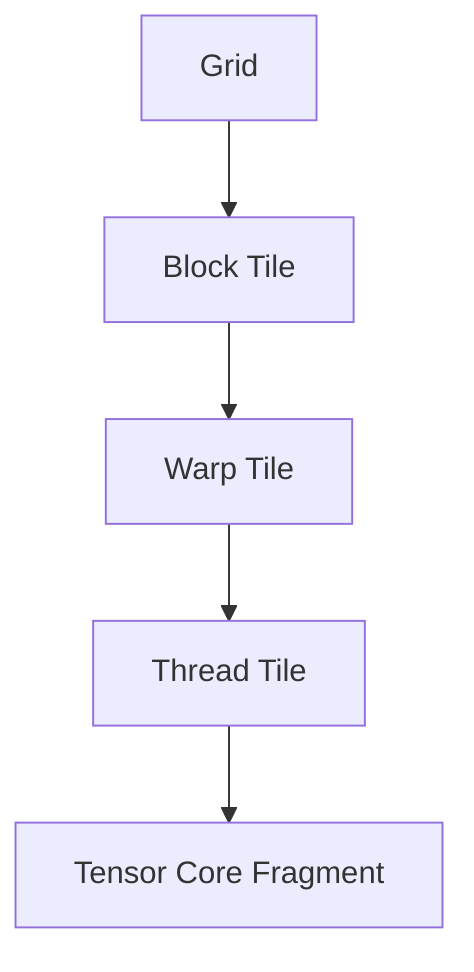

# Rebuilding cuBLAS: From a Naive CUDA Kernel to a Tensor Core Pipeline

A correct GEMM kernel is easy to write. A fast one is not. This repository closes the gap between `~465 GFLOP/s` and the `65 TFLOP/s` FP16 Tensor Core peak through a repeated diagnostic loop:

**profile → identify bottleneck → intervene → re-measure**

Each kernel version isolates one structural change, explains the bottleneck it targets, and documents what becomes the next limiting factor.


---

## Table of Contents

1. [Problem Statement](#1-problem-statement)
2. [Research Objective](#2-research-objective)
3. [Why GEMM Matters](#3-why-gemm-matters)
4. [Hardware Context](#4-hardware-context)
5. [Conceptual Dataflow](#5-conceptual-dataflow)
6. [Execution Hierarchy](#6-execution-hierarchy)
7. [Optimization Roadmap](#7-optimization-roadmap)
8. [Stage-by-Stage Breakdown](#8-stage-by-stage-breakdown)
9. [Performance Results](#9-performance-results)
10. [Development Backlog](#10-development-backlog)
    - [10.1 Compilation and the NVCC Story](#101-compilation-and-the-nvcc-story)
    - [10.2 The Memory Wall Problem](#102-the-memory-wall-problem)
    - [10.3 What's Next](#103-whats-next)
11. [Experimental Methodology](#11-experimental-methodology)
12. [Conclusion](#12-conclusion)
13. [Inspiration and Acknowledgement](#13-inspiration-and-acknowledgement)

---

## 1. Problem Statement

The core computation studied here is GEMM:

```
C = alpha * A * B + beta * C
```

Following standard conventions:

- `A ∈ ℝ^(M × K)`
- `B ∈ ℝ^(K × N)`
- `C ∈ ℝ^(M × N)`

A naive GPU implementation of GEMM fails to exploit the memory and execution hierarchies of NVIDIA GPUs. Despite enormous theoretical parallelism, a simple kernel typically suffers from:

- excessive global-memory traffic
- poor data reuse and low arithmetic intensity
- high load/store instruction overhead
- register pressure
- insufficient overlap between memory and compute
- underutilization of Tensor Cores

This repository investigates how those inefficiencies can be removed systematically through kernel restructuring.

---

## 2. Research Objective

> **How does a CUDA GEMM kernel need to be transformed, stage by stage, to progress from a correctness-oriented baseline to a structured, high-performance GPU matrix multiplication?**

The project aims to:

1. Identify the dominant bottleneck at each optimization stage.
2. Introduce one isolated structural optimization to address that bottleneck.
3. Explain the resulting dataflow and execution model.
4. Analyze the trade-offs each architectural change introduces.
5. Build a logical progression from scalar CUDA core execution to asynchronous Tensor Core pipelines.

---

## 3. Why GEMM Matters

GEMM is foundational in scientific computing, numerical linear algebra, and deep learning. Many higher-level operations reduce to matrix multiplication, making it a core primitive that often determines end-to-end performance.

For GPU performance engineering, GEMM is an ideal case study because it exposes the full interaction between:

- thread hierarchy and warp scheduling
- global and shared memory bandwidth
- register reuse and instruction issue throughput
- specialized hardware such as Tensor Cores

---

## 4. Hardware Context

The diagrams below serve as architectural reference throughout the optimization story.


Key notes:

- Kernels are written from the perspective of a single thread's local work.
- All threads in the grid execute the same kernel function.
- Performance comes from coordinating those threads to match the GPU's memory and execution hierarchy.

---

## 5. Conceptual Dataflow

Optimized GEMM progressively transforms the computation from direct global-memory access into a staged, hierarchical pipeline:


The optimization sequence improves each transition:

- global memory → shared memory
- shared memory → registers
- registers → accumulators
- accumulators → final output

---

## 6. Execution Hierarchy

An optimized GEMM must align with the GPU's execution hierarchy at every level:



Early kernels operate at the block and thread level. Later kernels introduce warp-aware tiling and Tensor Core mapping so that work granularity matches the actual hardware scheduling model.

---

## 7. Optimization Roadmap

| Version | File                                       | Core Optimization              | Main Bottleneck Targeted                         |
| :------ | :----------------------------------------- | :----------------------------- | :----------------------------------------------- |
| **01**  | `01. Build Naive SGEMM.cu`                 | Baseline CUDA SGEMM            | Establish correctness and baseline mapping       |
| **02**  | `02. Shared Memory Tiling.cu`              | Shared-memory tiling           | Repeated global-memory accesses                  |
| **03**  | `03. Register Tiling - 1 side.cu`          | 1D register tiling             | Low arithmetic intensity                         |
| **04**  | `04. Register Tiling - 2 side.cu`          | 2D register tiling             | Excessive shared-memory traffic per output       |
| **05**  | `05. Vectorized Register Tiling.cu`        | Vectorized loads/stores        | Load/store instruction pressure                  |
| **06**  | `06. Warp Tiling.cu`                       | Warp tiling                    | Scheduler alignment, locality, register pressure |
| **07**  | `07. Tensor Cores (Async TMA + WGMMA).cu`  | WMMA Tensor Core baseline      | Transition from scalar FMA to Tensor Cores       |
| **08**  | `08. Tensor Cores - Shared Memory WMMA.cu` | Shared-memory staged WMMA      | Tensor Core operand reuse and feed efficiency    |
| **09**  | `09. Async Producer–Consumer Pipeline.cu`  | Software pipelining & epilogue | Pipeline bubbles and load/compute serialization  |

---

## 8. Stage-by-Stage Breakdown

Each version is explained with: the core formula, the thread/block mapping, the memory access pattern, the arithmetic intensity, and the hardware units involved.

---

### Version 01: Naive SGEMM


**Core formula**

Each element of the output matrix is a dot product over the full reduction dimension `K`:

```
C[row][col] = sum( A[row][k] * B[k][col] )  for k = 0 .. K-1
```

**Thread mapping**

```
thread (tx, ty) owns output element C[blockIdx.y * blockDim.y + ty][blockIdx.x * blockDim.x + tx]
```

One thread → one output. Every thread walks all `K` steps independently.

**Memory access pattern**

For a single output element:

- reads `A[row][0..K-1]` → `K` global loads, not reused by any neighbor
- reads `B[0..K-1][col]` → `K` global loads, not reused by any neighbor

Two threads in the same row that compute adjacent columns re-read the same row of `A` from global memory independently.

**Arithmetic intensity**

```
FLOPs per output = 2 * K   (K multiplies + K adds)
Bytes loaded     = 2 * K * 4 bytes  (A row + B column, both float32)

Arithmetic intensity = (2K) / (8K) = 0.25 FLOP/byte
```

For `K=2048` this is still only `0.25 FLOP/byte`. The T4 needs roughly `13 FLOP/byte` to be compute-bound. This kernel is entirely memory-bound.

**Hardware units used**

- FP32 CUDA cores for the FMA
- Global memory (HBM) for every load — no caching

**Bottleneck**

Every thread independently re-fetches data that neighboring threads also need. Global memory bandwidth is fully wasted on redundant loads.

---

### Version 02: Shared-Memory Tiling


**Core idea**

Instead of each thread fetching independently, the whole block cooperates to load a tile of `A` and a tile of `B` into fast shared memory. All threads in the block then compute from that shared tile.

**Tile dimensions**

```
Block tile:  BM rows of C × BN cols of C, computed by a BM×BN thread block
K-tile:      BK columns of A  /  BK rows of B  loaded each iteration
```

**Core formula (per tile iteration)**

```
// Load tile into shared memory (all threads cooperate)
As[ty][tx] = A[row][tile * BK + tx]
Bs[ty][tx] = B[tile * BK + ty][col]
__syncthreads()

// Accumulate over the tile
for k = 0 .. BK-1:
    acc += As[ty][k] * Bs[k][tx]

__syncthreads()
```

After `K/BK` iterations: `C[row][col] = acc`

**Memory access pattern**

Each tile of `A` (size `BM × BK`) is loaded once from global memory and reused by all `BN` threads in that block row.

```
Global loads per output element = 2K / BK  (one load per tile, shared across the block)
Reuse factor for A tile         = BN
Reuse factor for B tile         = BM
```

**Arithmetic intensity**

```
FLOPs per block tile        = 2 * BM * BN * BK
Global bytes loaded per tile = (BM*BK + BK*BN) * 4

Arithmetic intensity = (2 * BM * BN * BK) / (4 * BK * (BM + BN))
                     = (BM * BN) / (2 * (BM + BN))
```

For `BM = BN = 32`: `intensity = (32×32) / (2×64) = 8 FLOP/byte` — a significant improvement.

**Hardware units used**

- Shared memory (SMEM) inside each SM — ~164 KB per SM, much lower latency than HBM
- `__syncthreads()` barrier — coordinates all threads in a block
- FP32 CUDA cores for FMA

**New bottleneck**

Each thread still computes only one output. That output requires reading `BK` elements from `As` and `BK` elements from `Bs` on every tile. Shared-memory reads are cheap but not free, and arithmetic intensity is still capped at `O(tile_size)`.

---

### Version 03: Thread-level Strip Tiling (1D tilling)


**Core idea**

Assign each thread a strip of `TM` consecutive output rows instead of one. While iterating over the K-tile, the thread loads one value from `Bs` and reuses it across all `TM` rows.

**Thread mapping**

```
thread ty owns output rows:  [ty * TM  ..  ty * TM + TM - 1]
thread tx owns output col:   tx
```

**Core formula (per tile, per k step)**

```
// Load TM values from A tile into local register array
for i = 0 .. TM-1:
    a_reg[i] = As[ty * TM + i][k]

// Load one value from B tile — reused TM times
b_reg = Bs[k][tx]

// TM multiply-accumulates from one b_reg value
for i = 0 .. TM-1:
    acc[i] += a_reg[i] * b_reg
```

**Arithmetic intensity**

```
FLOPs per k step    = 2 * TM        (TM FMAs, one b_reg shared)
SMEM loads per step = TM + 1        (TM from As, 1 from Bs)

Intensity ≈ 2*TM / (TM+1) → approaches 2 FLOP/load as TM grows
```

For `TM=8`: roughly `1.78 FLOP/SMEM load`. Fewer shared-memory reads per output reduces shared-memory bank pressure.

**Hardware units used**

- Register file (fastest storage, private per thread)
- Shared memory for tile loads
- FP32 CUDA cores for FMA

---

### Version 04: Register Tiling (2D)


**Core idea**

Extend register tiling to both dimensions. Each thread computes a `TM × TN` output sub-tile. A single k-step loads `TM` values from `As` and `TN` values from `Bs`, then computes a full outer product.

**Thread mapping**

```
thread (tx, ty) owns output block:
    rows  [ty * TM  ..  ty * TM + TM - 1]
    cols  [tx * TN  ..  tx * TN + TN - 1]
```

**Core formula (per k step — the outer product)**

```
for i = 0 .. TM-1:
    a_reg[i] = As[ty * TM + i][k]

for j = 0 .. TN-1:
    b_reg[j] = Bs[k][tx * TN + j]

// Outer product: TM × TN FMAs
for i = 0 .. TM-1:
    for j = 0 .. TN-1:
        acc[i][j] += a_reg[i] * b_reg[j]
```

**Arithmetic intensity**

```
FLOPs per k step    = 2 * TM * TN
SMEM loads per step = TM + TN

Intensity = (2 * TM * TN) / (TM + TN)
```

For `TM = TN = 8`: `intensity = 128/16 = 8 FLOP/SMEM load`. Each element loaded from shared memory contributes to 8 outputs instead of 1.

**Register usage**

```
Registers per thread = TM (a_reg) + TN (b_reg) + TM*TN (acc)
For TM=TN=8: 8 + 8 + 64 = 80 registers per thread
```

High register usage can reduce occupancy (fewer warps active simultaneously), which is the main trade-off.

**Hardware units used**

- Register file for `a_reg`, `b_reg`, `acc`
- Shared memory for tile staging
- FP32 CUDA cores for the outer product FMAs

---

### Version 05: Vectorized Register Tiling


**Core idea**

Keep the 2D register tiling from v04 but replace all scalar `float` loads with 128-bit vector loads (`float4`). One instruction now fetches 4 consecutive floats.

**Vector load formula**

```
// Scalar (v04)
for i = 0..3:
    As[ty][tx*4 + i] = A[row][tile*BK + tx*4 + i]  // 4 separate instructions

// Vectorized (v05)
float4 tmp = reinterpret_cast<float4*>(&A[row][tile*BK + tx*4])[0]
As[ty][tx*4+0] = tmp.x;  As[ty][tx*4+1] = tmp.y;
As[ty][tx*4+2] = tmp.z;  As[ty][tx*4+3] = tmp.w;
// 1 instruction fetches all 4 values
```

**Why this helps — the coalescing rule**

Global memory transactions happen in 128-byte cache lines. When 32 threads in a warp each load a `float4` from consecutive addresses, all 32×16 = 512 bytes are served in 4 coalesced transactions. With scalar loads, the same data required 16 separate transactions.

**Instruction count reduction**

```
Scalar loads per tile (BM×BK):   BM * BK instructions
Vectorized loads (float4):        BM * BK / 4 instructions  → 4× fewer LD instructions
```

Fewer LD/ST instructions mean the warp scheduler has more slots to issue FMA instructions.

**Hardware units used**

- 128-bit LD/ST units (each SMSP has 16 LD/ST units)
- L2 cache line coalescing (128-byte lines)
- FP32 CUDA cores for FMA

---

**Them problem comes**:
This diagram revisits the same memory matrix background, unsynchronized threads (represented by red dots) are scattered randomly.


### Version 06: Warp Tiling


**Core idea**

Group threads into warp-owned output sub-tiles. A warp (32 threads) takes responsibility for a `WARP_M × WARP_N` output region. Within a warp, threads subdivide that region.

**Mapping**

```
warp_id   = threadIdx.x / 32
warp_row  = warp_id / (BN / WARP_N)
warp_col  = warp_id % (BN / WARP_N)

thread within warp:
    lane_row = lane_id / (WARP_N / TN)
    lane_col = lane_id % (WARP_N / TN)

Thread owns:
    rows  [warp_row*WARP_M + lane_row*TM  ..  +TM-1]
    cols  [warp_col*WARP_N + lane_col*TN  ..  +TN-1]
```

**Why warp alignment matters**

The GPU executes 32 threads together as a warp at all times. If threads in the same warp load from scattered addresses, the memory subsystem must serialize the accesses. Warp-aligned tiling ensures threads in a warp load from contiguous memory regions, maximizing coalescing and minimizing L1/L2 cache conflicts.

```
Without warp tiling:  thread n loads A[n][k]  — addresses spread across rows
With warp tiling:     all 32 threads load consecutive elements of the same row
                      → 1 cache line serves the whole warp
```

**Architectural significance**

The warp is the actual unit of execution in NVIDIA hardware. Tensor Cores require a full warp to call `wmma::mma_sync`. This version establishes the warp as the owner of a fixed output tile — exactly the mental model needed for Tensor Cores.

**Hardware units used**

- Warp scheduler (4 warps per SMSP in Hopper)
- L1 data cache and shared memory
- FP32 CUDA cores

---

**The problem comes**:

- How can we speed up the matrix multiplication. Currently, 1 warpusing 1 FMA = 1 multiply + 1add = 2FLOP \* 32 = 64 FLOP/instruction
  whcih is not fast as we think. How about using FP16 with WMMA

### Version 07: Tensor Core WMMA Baseline


**The hardware operation**

Tensor Cores perform a warp-wide matrix multiply-accumulate in a single instruction:

```
D[16×16] = A[16×16] × B[16×16] + C[16×16]
```

All 32 threads in the warp cooperate. Each thread holds a fragment of the matrices, and the hardware fuses the operation into a dense matrix multiply executed in 1–2 clock cycles.

**WMMA fragment types and sizes**

```
wmma::fragment<wmma::matrix_a, 16, 16, 16, half, wmma::row_major>    a_frag;
wmma::fragment<wmma::matrix_b, 16, 16, 16, half, wmma::col_major>    b_frag;
wmma::fragment<wmma::accumulator, 16, 16, 16, float>                  c_frag;
```

Precision: `A` and `B` are `FP16` (16-bit), accumulator `C/D` is `FP32` (32-bit).

**WMMA call sequence**

```cpp
wmma::load_matrix_sync(a_frag, A_ptr + ..., lda);       // load 16×16 tile of A
wmma::load_matrix_sync(b_frag, B_ptr + ..., ldb);       // load 16×16 tile of B
wmma::fill_fragment(c_frag, 0.0f);                      // zero accumulator

for (int tile = 0; tile < K/16; tile++) {
    wmma::load_matrix_sync(a_frag, ...);
    wmma::load_matrix_sync(b_frag, ...);
    wmma::mma_sync(c_frag, a_frag, b_frag, c_frag);    // D = A*B + C
}

wmma::store_matrix_sync(C_ptr + ..., c_frag, ldc, wmma::mem_row_major);
```

**FLOPs per Tensor Core instruction**

```
One mma_sync on a 16×16×16 tile:
    16 × 16 × 16 × 2 = 8192 FLOPs per warp per instruction
```

In comparison, a scalar FMA on 32 FP32 CUDA cores issues 32 × 2 = 64 FLOPs per instruction. Tensor Cores produce 128× more arithmetic per issued instruction.

**Why the kernel is still slow (version 07)**

Fragments are loaded directly from global memory. The global memory bus (`320 GB/s` on T4) cannot feed the Tensor Cores fast enough.

```
Tensor Core throughput:  ~65 TFLOP/s  → needs ~65 TB/s of operand bandwidth
Global memory bandwidth: ~320 GB/s    → ~200× too slow
```

**Hardware units used**

- 4th-Gen Tensor Cores (one per SMSP in Hopper)
- Global memory (HBM) for fragment loads — the bottleneck

---

### Version 08: Shared-Memory Staged WMMA

**Core idea**

Load `A` and `B` tiles into shared memory first (cooperatively, with all warps in the block), then load WMMA fragments from shared memory.

**Data flow**

```
Global Memory → [cooperative block load] → Shared Memory → [wmma::load_matrix_sync] → Fragments → Tensor Cores
```

**Tile layout in shared memory**

```
Shared A tile:  BM × BK  (e.g., 64 × 16)
Shared B tile:  BK × BN  (e.g., 16 × 64)

Each warp loads its 16×16 fragment from the relevant slice:
    a_frag ← As[warp_row*16 : warp_row*16+16][k*16 : k*16+16]
    b_frag ← Bs[k*16 : k*16+16][warp_col*16 : warp_col*16+16]
```

**Reuse analysis**

```
With global loads (v07):
    Each warp fetches its own 16×16 tile from global memory.
    BN/16 warps in the same block column all fetch the same A tile independently.

With shared memory (v08):
    The block loads the A tile once into shared memory.
    All BN/16 warps read from shared memory — reuse factor = BN/16.
```

**Arithmetic intensity improvement**

```
v07: intensity = (2 * BM * BN * BK) / (2 * (BM*BK + BK*BN) * 2 bytes)   (FP16 global loads)
v08: global loads unchanged but data is reused BN/16 times from SMEM instead of re-fetched
     effective bandwidth demand drops by factor BN/16
```

**Hardware units used**

- Tensor Cores for `mma_sync`
- Shared memory for tile staging (256 KB configurable, Hopper)
- LD/ST units for cooperative global→shared loads

---

### Version 09: Producer-Consumer Pipeline and Epilogue Staging

**Core idea: double buffering**

Allocate two sets of shared memory buffers (ping-pong). While the compute warp processes tile `t` from buffer 0, the memory warp prefetches tile `t+1` into buffer 1. On the next iteration, they swap.

**Buffer layout**

```
__shared__ half As[2][BM][BK];   // double buffer for A
__shared__ half Bs[2][BK][BN];   // double buffer for B

int write_buf = 0;
int read_buf  = 1;
```

**Pipeline structure**

```
// Prefetch tile 0 into write_buf before the main loop
async_load(As[write_buf], A_tile_0);
async_load(Bs[write_buf], B_tile_0);
cp_async_wait();

for tile = 1 .. K/BK:
    swap(write_buf, read_buf);

    // Prefetch next tile into write_buf  (PRODUCER)
    async_load(As[write_buf], A_tile[tile]);
    async_load(Bs[write_buf], B_tile[tile]);

    // Compute on current tile from read_buf  (CONSUMER)
    for warp_k = 0 .. BK/16-1:
        wmma::load_matrix_sync(a_frag, As[read_buf][...]);
        wmma::load_matrix_sync(b_frag, Bs[read_buf][...]);
        wmma::mma_sync(c_frag, a_frag, b_frag, c_frag);

    cp_async_wait();   // ensure next tile is ready before next swap
```

**Epilogue staging in shared memory**

Instead of writing the `FP32` accumulator directly to global memory (which produces uncoalesced writes when the output tile is small), the result is first written into shared memory in a layout optimized for coalesced global writes:

```
// Store fragment to shared memory with output-friendly layout
wmma::store_matrix_sync(Cs_epilogue + ..., c_frag, BN, wmma::mem_row_major);
__syncthreads();

// Coalesced vectorized write from SMEM to global memory
for each row in [0, BM):
    float4 val = reinterpret_cast<float4*>(Cs_epilogue + row*BN + tx*4)[0];
    C[global_row + row][global_col + tx*4] = val;
```

**Latency hiding model**

```
Without pipelining:
    [LOAD tile t] → [SYNC] → [COMPUTE tile t] → [LOAD tile t+1] → ...
    Load latency is fully exposed every iteration.

With double-buffer pipelining:
    [LOAD tile t+1] overlapped with [COMPUTE tile t]
    Load latency is hidden behind compute time.
```

The effectiveness depends on whether the compute time for one tile (`BM × BN × BK × 2 FLOPs / Tensor Core throughput`) is long enough to cover the load latency (`BM*BK + BK*BN bytes / bandwidth`).

**Hardware units used**

- `cp.async` (Ampere+) or synchronous loads with explicit double buffering (Turing)
- Tensor Cores for `mma_sync`
- Shared memory for both operand staging and epilogue layout
- LD/ST units with 128-bit vector paths for coalesced epilogue writes

---

## 9. Performance Results

Benchmark: matrix dimensions `2048 × 2048 × 2048`.

| Kernel                             | Time (ms) | Performance (GFLOP/s) | Max Absolute Error | Status  |
| :--------------------------------- | :-------- | :-------------------- | :----------------- | :------ |
| **01. Naive SGEMM**                | 36.896    | 465.63                | 1.83e-04           | ✅ Pass |
| **02. Shared Memory Tiling**       | 20.195    | 850.68                | 1.83e-04           | ✅ Pass |
| **03. Register Tiling (1D)**       | 16.164    | 1062.82               | 1.83e-04           | ✅ Pass |
| **04. Register Tiling (2D)**       | 12.473    | 1377.36               | 1.83e-04           | ✅ Pass |
| **05. Vectorized Register Tiling** | 5.199     | 3304.42               | 1.83e-04           | ✅ Pass |
| **06. Warp Tiling**                | 13.326    | 1289.19               | 1.83e-04           | ✅ Pass |
| **07. Tensor Cores (WMMA)**        | 7.780     | 2208.25               | 0.00e+00           | ✅ Pass |
| **08. Tensor Cores SMEM WMMA**     | 7.052     | 2436.32               | 0.00e+00           | ✅ Pass |
| **09. Async Pipeline WMMA**        | 6.340     | 2709.72               | 0.00e+00           | ✅ Pass |

---

## 10. Development Backlog

### 10.1 Compilation and the NVCC Story

`nvcc` is not just a compiler. It is a multi-stage compilation driver, and a missing architecture flag can produce silently wrong results that pass compilation and report plausible-looking (but completely fabricated) performance numbers.

- **Stage 1 — Split.** `nvcc` separates host code (handed to `clang`/`gcc`) from device code (handled by NVIDIA's device compiler). This is why `__CUDA_ARCH__` guards exist: they are only defined during the device compilation pass.

- **Stage 2 — PTX generation.** Device code is lowered to PTX, NVIDIA's virtual assembly. This is where WMMA intrinsics map to PTX instructions:

```
nvcuda::wmma::mma_sync(...)    →  wmma.mma.sync.aligned.m16n16k16.row.col.f32.f16.f16.f32
nvcuda::wmma::load_matrix_sync →  wmma.load.a.sync.aligned.m16n16k16.global.row
```

- **Stage 3 — SASS via `ptxas`.** PTX is compiled to real machine instructions. This is where `-arch=sm_75` becomes critical. Without it, `ptxas` defaults to `sm_52` (Maxwell), which has no WMMA opcodes. The `#if __CUDA_ARCH__ >= 700` block compiles away entirely, producing a kernel that completes in `0.006 ms` and reports `2.7 PFLOP/s` — a perfectly empty benchmark. This was the root cause of ghost performance numbers seen in versions 07–09 before the flag was identified.

- **Stage 4 — Fatbinary packaging.** The final binary packages both PTX and the compiled cubin. The CUDA driver selects the right path at runtime based on actual hardware.

> **Compiler flags are not optimization hints. They are architecture contracts.**

### 10.2 The Memory Wall Problem

After validating all nine kernels against cuBLAS, a deeper question surfaced:

> Why did Tensor Core kernels (07–09) top out at `~2.7 TFLOP/s` — below the pure FP32 vectorized kernel (05) at `3.3 TFLOP/s` — on hardware with a `65 TFLOP/s` FP16 Tensor Core peak?

The answer: Tensor Cores finish a `16×16×16` matrix multiply in 1–2 clock cycles, then the warp idles waiting for the next tile to arrive over the `320 GB/s` global memory bus. Version 05 issued `8×` fewer memory instructions using `float4` vectorized loads and saturated the bus more efficiently.

This is the classic **memory wall**.

**Kernel 10 (attempted):** replacing scalar `__half` loads with `int4` (128-bit) vectorized loads and `float4` epilogue writes produced a result slightly _slower_ than version 09 (`2466` vs `2709 GFLOP/s`). The reason: tiles (`BLOCK_TILE_M=32, BLOCK_TILE_N=64`) were too small. With 256 threads but only 64 `int4` loads for the A tile, 75% of threads sat idle during each load phase. Instruction count dropped 8×, but so did warp-level memory parallelism.

> **Vectorization and larger tiles must go together.**

### 10.3 What's Next

| Kernel | Target Hardware   | Technique                                                                                                       |
| :----- | :---------------- | :-------------------------------------------------------------------------------------------------------------- |
| **11** | Turing (T4, SM75) | `128×128` tiles with `int4` vectorized loads — closing the memory wall                                          |
| **12** | Ampere+ (SM80)    | `cp.async` pipeline — hardware-async Global→Shared, warp never stalls on a load                                 |
| **13** | Hopper (SM90)     | `TMA + WGMMA` — dedicated DMA engine and 4-warp cooperative MMA, foundation of modern FlashAttention and cuBLAS |

---

## 11. Experimental Methodology

All kernels are evaluated under the same protocol:

1. **Fixed dimensions** — standardized matrix sizes (e.g., `M=N=K=4096`) ensure caching effects are consistent across runs.
2. **Warmup runs** — cold-start anomalies are masked before timing begins.
3. **Reference validation** — maximum absolute error is checked against cuBLAS to guarantee correctness.
4. **Profiling** — throughput is reported in `GFLOP/s` and paired with Nsight Compute stall metrics (Memory Dependency, Execution Dependency) to explain each bottleneck.

---

## 12. Conclusion

High-performance GEMM is not the result of one algorithmic trick. It emerges from a sequence of hardware-aligned structural changes, each one removing the constraint that was limiting the previous version. By tracing the full path from naive global-memory access to asynchronous Tensor Core pipelines, this repository makes the trade-offs of modern GPU programming concrete and observable.

---

## 13. Inspiration and Acknowledgement

This work is shaped by performance-engineering writeups that treat GEMM optimization as a sequence of isolated structural changes rather than a single opaque final kernel. In particular, Hamza Elshafie's H100 GEMM optimization study helped frame the methodology: analyze one optimization at a time, identify the bottleneck it targets, and explain the hardware consequences of each change.
