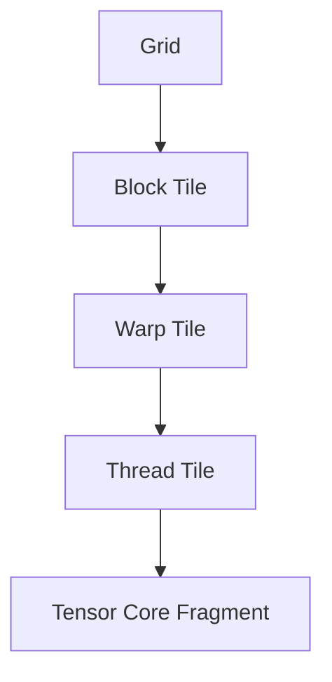

# Rebuilding cuBLAS: From a Naive CUDA Kernel to a Tensor Core Pipeline

How a GEMM kernel evolves from a correctness-first CUDA baseline into a hardware-aware Tensor Core pipeline. The focus is not a single trick, but a repeated diagnostic loop:

**profile -> identify bottleneck -> intervene -> re-measure**

Each kernel isolates one structural optimization, explains the bottleneck it targets, and documents what becomes the next limiting factor.

## Table of Contents

- [Project Overview](#project-overview)
- [Why This Repository Exists](#why-this-repository-exists)
- [Problem Statement](#problem-statement)
- [Research Objective](#research-objective)
- [Why GEMM Matters](#why-gemm-matters)
- [Hardware Context](#hardware-context)
- [Performance Tracking](#performance-tracking)
- [Conceptual Dataflow](#conceptual-dataflow)
- [Execution Hierarchy](#execution-hierarchy)
- [Optimization Roadmap](#optimization-roadmap)
- [Stage-by-Stage Breakdown](#stage-by-stage-breakdown)
- [Development Backlog](#development-backlog)
- [Experimental Methodology](#experimental-methodology)
- [Conclusion](#conclusion)
- [Inspiration and Acknowledgement](#inspiration-and-acknowledgement)

## Project Overview

The project starts with a kernel that works but runs at roughly `465 GFLOP/s` on hardware with a `65 TFLOP/s` FP16 Tensor Core peak. That gap is the real subject of the repository.

By the end of the sequence, the code has introduced:

- memory coalescing
- shared-memory tiling
- register tiling
- vectorized loads and stores
- warp-level work ownership
- Tensor Core WMMA
- shared-memory operand staging
- software pipelining with a producer-consumer structure

The endpoint is not the absolute fastest possible kernel. The goal is to explain why each transformation became necessary and what trade-offs it introduced.

## Why This Repository Exists

A correct GEMM kernel is easy to write. A fast one is not. The difference is rarely explained by one clever optimization. It comes from matching the kernel structure to the GPU's memory hierarchy, execution model, and specialized compute hardware.

This repository treats GEMM optimization as a sequence of bottleneck-removal steps rather than a collection of disconnected tricks.

## Problem Statement

The core computation studied in this repository is GEMM:

`C = alpha * A * B + beta * C`

Following standard conventions:

- `A in R^(M x K)`
- `B in R^(K x N)`
- `C in R^(M x N)`

A naive GPU implementation of GEMM fails to exploit the memory and execution hierarchies of NVIDIA GPUs. Even though GEMM has enormous theoretical parallelism, a simple kernel usually suffers from:

- excessive global-memory traffic
- poor data reuse
- low arithmetic intensity
- high load/store instruction overhead
- register pressure
- insufficient overlap between memory and compute
- underutilization of Tensor Cores

This repository investigates how those inefficiencies can be removed systematically through kernel restructuring.

## Research Objective

This project aims to answer the following question:

> **How does a CUDA GEMM kernel need to be transformed, stage by stage, to progress from a correctness-oriented baseline to a structured, high-performance GPU matrix multiplication?**

More concretely, the project aims to:

1. Identify the dominant bottleneck at each optimization stage.
2. Introduce one isolated structural optimization to mitigate that bottleneck.
3. Explain the resulting dataflow and execution model.
4. Analyze the trade-offs introduced by each architectural change.
5. Construct a logical progression from scalar CUDA core execution to asynchronous Tensor Core pipelines.

## Why GEMM Matters

GEMM is a foundational kernel in scientific computing, numerical linear algebra, and deep learning. Many higher-level operations reduce to matrix multiplication, which makes GEMM more than a benchmark: it is a core primitive that often determines end-to-end performance.

For GPU performance engineering, GEMM is an ideal case study because it exposes the interaction between:

- thread hierarchy
- warp scheduling
- global and shared memory bandwidth
- register reuse
- instruction issue throughput
- specialized hardware such as Tensor Cores

## Hardware Context

The images below are included as architectural reference for the optimization story:

Key notes:

- kernels are written from the perspective of a single thread's local work
- all threads in the grid execute the same kernel function
- performance comes from coordinating those threads to match the memory and execution hierarchy of the GPU

## Performance Tracking

The following table records the measured performance for a `2048 x 2048 x 2048` benchmark.

| Kernel                             | Time (ms) | Performance (GFLOP/s) | Max Absolute Error | Status  |
| :--------------------------------- | :-------- | :-------------------- | :----------------- | :------ |
| **01. Naive SGEMM**                | 36.896    | 465.63                | 1.83e-04           | ✅ Pass |
| **02. Shared Memory Tiling**       | 20.195    | 850.68                | 1.83e-04           | ✅ Pass |
| **03. Register Tiling (1D)**       | 16.164    | 1062.82               | 1.83e-04           | ✅ Pass |
| **04. Register Tiling (2D)**       | 12.473    | 1377.36               | 1.83e-04           | ✅ Pass |
| **05. Vectorized Register Tiling** | 5.199     | 3304.42               | 1.83e-04           | ✅ Pass |
| **06. Warp Tiling**                | 13.326    | 1289.19               | 1.83e-04           | ✅ Pass |
| **07. Tensor Cores (WMMA)**        | 7.780     | 2208.25               | 0.00e+00           | ✅ Pass |
| **08. Tensor Cores SMEM WMMA**     | 7.052     | 2436.32               | 0.00e+00           | ✅ Pass |
| **09. Async Pipeline WMMA**        | 6.340     | 2709.72               | 0.00e+00           | ✅ Pass |

## Conceptual Dataflow

Optimized GEMM progressively transforms the computation from direct global-memory access into a staged, hierarchical pipeline:

The optimization sequence improves each transition:

- global memory to shared memory
- shared memory to registers
- registers to accumulators
- accumulators to final output storage

## Execution Hierarchy

An optimized GEMM must align with the GPU's execution hierarchy:

Early kernels mostly operate at the block and thread level. Later kernels introduce warp-aware tiling and Tensor Core mapping so that the work granularity matches the hardware's scheduling and execution model.

## Optimization Roadmap

| Version | File                                       | Core Optimization              | Main Bottleneck Targeted                           |
| :------ | :----------------------------------------- | :----------------------------- | :------------------------------------------------- |
| **01**  | `01. Build Naive SGEMM.cu`                 | Baseline CUDA SGEMM            | Establish correctness and baseline mapping         |
| **02**  | `02. Shared Memory Tiling.cu`              | Shared-memory tiling           | Repeated global-memory accesses                    |
| **03**  | `03. Register Tiling - 1 side.cu`          | 1D register tiling             | Low arithmetic intensity                           |
| **04**  | `04. Register Tiling - 2 side.cu`          | 2D register tiling             | Excessive shared-memory traffic per output         |
| **05**  | `05. Vectorized Register Tiling.cu`        | Vectorized loads/stores        | Load/store instruction pressure                    |
| **06**  | `06. Warp Tiling.cu`                       | Warp tiling                    | Scheduler alignment, locality, register pressure   |
| **07**  | `07. Tensor Cores (Async TMA + WGMMA).cu`  | WMMA Tensor Core baseline      | Transition compute from scalar FMA to Tensor Cores |
| **08**  | `08. Tensor Cores - Shared Memory WMMA.cu` | Shared-memory staged WMMA      | Tensor Core operand reuse and feed efficiency      |
| **09**  | `09. Async Producer–Consumer Pipeline.cu`  | Software pipelining & epilogue | Pipeline bubbles and load/compute serialization    |

## Stage-by-Stage Breakdown

### Version 1: Naive SGEMM

The baseline kernel maps output elements directly to threads. Each thread computes one output by traversing the full reduction dimension.

- Demonstrates the basic GEMM structure and standard grid-to-matrix mapping.
- Suffers from redundant global-memory loads and very low arithmetic intensity.

### Version 2: Shared-Memory Tiling

This version introduces block-cooperative loading of `A` and `B` tiles into shared memory.

- A single tile loaded from global memory is reused across the block.
- Global-memory traffic drops significantly.
- Shared-memory traffic becomes the next bottleneck.

### Versions 3 and 4: Register Tiling

These versions move reuse deeper into the hierarchy by assigning multiple output elements to each thread.

- Registers now hold operands reused across multiple FMAs.
- Arithmetic intensity improves.
- Shared-memory reads per output are reduced.
- Register pressure increases and can reduce occupancy if poorly tuned.

### Version 5: Vectorized Register Tiling

This stage targets instruction pressure in the memory path.

- Vector instructions such as `float4` fetch multiple elements per issued instruction.
- Load/store instruction count drops.
- Front-end efficiency improves even without changing the algorithm itself.

### Version 6: Warp Tiling

This version introduces warp-level ownership of output sub-tiles.

- Work is aligned with the GPU's real execution unit: the warp.
- Scheduler alignment and spatial locality improve.
- Redundant register usage is reduced.
- This is the conceptual bridge toward Tensor Core kernels.

### Version 7: Tensor Core WMMA Baseline

This stage replaces scalar FMA execution on CUDA cores with warp-wide matrix multiply-accumulate operations on Tensor Cores.

- Specialized matrix hardware is now used for dense math.
- The optimization problem shifts from organizing scalar arithmetic to feeding Tensor Cores efficiently.

### Version 8: Shared-Memory Staged WMMA

This version stages Tensor Core operands through shared memory rather than relying only on global-memory fragment loads.

- Operand reuse across warps improves.
- Locality improves substantially.
- The dataflow becomes much closer to production-grade Tensor Core kernels.

### Version 9: Producer-Consumer Pipeline and Epilogue Staging

This stage adds software pipelining and structured epilogue staging in shared memory.

- Memory fetches and computation are overlapped.
- Tensor Core stalls are reduced.
- Output writes can be coalesced more efficiently before the final global-memory store.

## Development Backlog

### Compilation and Infrastructure: The NVCC Story

One key lesson from this project is that `nvcc` is not just a compiler. It is a multi-stage compilation driver that coordinates several tools, and missing the correct architecture flag can produce silently wrong results.

- **Stage 1 - Split:** `nvcc` separates host code from device code. Host code goes to the system C++ compiler. Device code goes to NVIDIA's device compiler. This is why `__CUDA_ARCH__` guards matter: they only exist during the device compilation pass.
- **Stage 2 - PTX generation:** device code is lowered into `PTX`, NVIDIA's virtual assembly. This is where WMMA intrinsics map to PTX-level instructions.
- **Stage 3 - SASS compilation via `ptxas`:** `PTX` is compiled into real machine instructions. This is where `-arch=sm_75` becomes critical. Without it, WMMA code can compile away and produce fake benchmark results from an effectively empty kernel.
- **Stage 4 - Fatbinary packaging:** the final binary packages both PTX and architecture-specific machine code so the CUDA driver can select the correct path at runtime.

This investigation reinforced an important point:

**compiler flags are not just optimization hints; they are architecture contracts**

### Performance Backlog

After getting the first nine kernels running and validated against cuBLAS, a new question emerged:

> Why did the Tensor Core kernels in versions 07 to 09 top out at about `2.7 TFLOP/s`, still below the `3.3 TFLOP/s` achieved by the pure FP32 vectorized kernel in version 05?

The T4 has a theoretical FP16 Tensor Core peak near `65 TFLOP/s`. The kernels were mathematically correct, but the Tensor Cores were not being fed efficiently enough.

### Discovery: It Was Never About Compute

Tensor Cores can finish a `16 x 16 x 16` matrix multiply in only a few cycles. The real problem is that the warp then waits for the next tile to arrive from global memory.

Meanwhile, version 05 used `float4` vectorized loads, which issued far fewer memory instructions and fed the memory subsystem more efficiently. That is why a pure FP32 kernel could outperform the Tensor Core version on the same hardware.

This is the classic **memory wall**.

### Attempted Next Step

**Kernel 10: Vectorized TC Pipeline**

The attempted follow-up replaced scalar `__half` loads with `int4` vectorized loads and used `float4` in the epilogue. The result was slightly worse than version 09.

The reason was tile size. With small tiles such as `BLOCK_TILE_M=32` and `BLOCK_TILE_N=64`, too many threads became idle during each vectorized load phase. Instruction count went down, but so did memory parallelism.

The key lesson:

**vectorization and larger tiles must go together**

### What's Next

The likely next steps in the series are:

- **Kernel 11:** `128 x 128` tiles with `int4` vectorized loads on T4
- **Kernel 12:** `cp.async` pipeline on Ampere and newer GPUs
- **Kernel 13:** `TMA + WGMMA` on Hopper, the foundation of kernels used in modern cuBLAS and FlashAttention implementations

## Experimental Methodology

The repository uses a consistent benchmarking protocol across kernel versions:

1. Fixed problem dimensions are used to make performance comparisons meaningful.
2. Warmup runs are used to remove cold-start effects before timing.
3. Results are validated against a trusted reference such as cuBLAS.
4. Throughput is reported in `GFLOP/s` and interpreted together with profiling metrics such as memory stalls and execution stalls.

## Conclusion

This project shows that high-performance GEMM is not the result of one algorithmic trick. It emerges from a sequence of hardware-aligned structural changes. By exposing the bottlenecks from naive global-memory access all the way to Tensor Core pipelines, the repository makes the trade-offs of modern GPU programming visible and concrete.

## Inspiration and Acknowledgement

This work is inspired by performance-engineering writeups that treat GEMM optimization as a sequence of isolated structural improvements rather than a single opaque final kernel. In particular, Hamza Elshafie's H100 GEMM optimization study helped shape the framing of this repository: analyze one optimization at a time, identify the bottleneck it targets, and explain the hardware consequences of each change.
